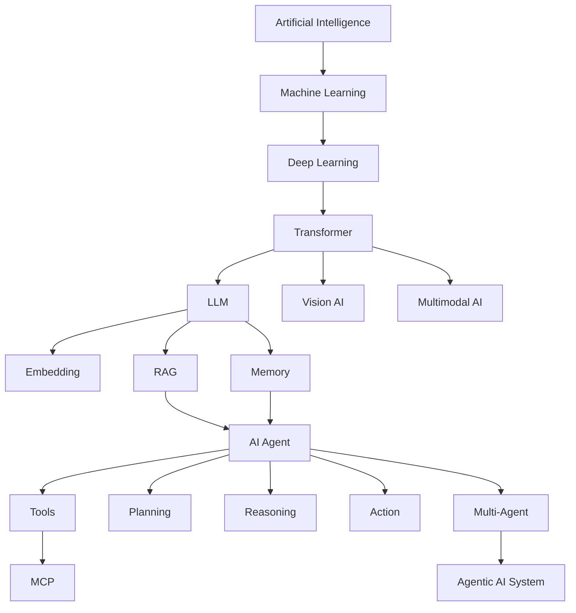
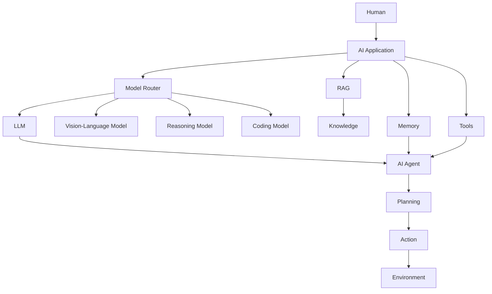

# AI Model

> **AI Model** คือแบบจำลองที่เรียนรู้จากข้อมูลเพื่อใช้ในการวิเคราะห์ ทำนาย จำแนก สร้างข้อมูล ตัดสินใจ และทำงานอัตโนมัติ

---

# สารบัญ

## 1. พื้นฐาน Artificial Intelligence

* [เรื่องที่ 1: พื้นฐาน Artificial Intelligence](./01-ai-foundation.md)

  * ความหมายของ AI
  * ประวัติและวิวัฒนาการของ AI
  * ประเภทของ AI
  * AI Model คืออะไร
  * AI Model vs AI System
  * AI Model vs Machine Learning
  * AI Model vs Deep Learning
  * AI Model vs Generative AI

---

## 2. Machine Learning Model

* [เรื่องที่ 2: Machine Learning Model](./02-machine-learning.md)

  * Supervised Learning
  * Unsupervised Learning
  * Semi-Supervised Learning
  * Self-Supervised Learning
  * Classification
  * Regression
  * Clustering
  * Dimensionality Reduction

---

## 3. Deep Learning Model

* [เรื่องที่ 3: Deep Learning Model](./03-deep-learning.md)

  * Neural Network
  * Artificial Neuron
  * Activation Function
  * Forward Propagation
  * Backpropagation
  * Loss Function
  * Optimization
  * CNN
  * RNN
  * LSTM
  * GRU
  * Transformer

---

## 4. Transformer Architecture

* [เรื่องที่ 4: Transformer Architecture](./04-transformer.md)

  * Transformer Architecture
  * Tokenization
  * Embedding
  * Positional Encoding
  * Self-Attention
  * Multi-Head Attention
  * Feed Forward Network
  * Residual Connection
  * Layer Normalization
  * Encoder
  * Decoder

---

## 5. Large Language Model (LLM)

* [เรื่องที่ 5: Large Language Model](./05-llm.md)

  * LLM คืออะไร
  * LLM Architecture
  * Token
  * Vocabulary
  * Context Window
  * Transformer-based LLM
  * Pretraining
  * Fine-Tuning
  * Instruction Tuning
  * Alignment
  * RLHF
  * DPO
  * Inference
  * Decoding
  * Sampling

---

## 6. Generative AI Model

* [เรื่องที่ 6: Generative AI Model](./06-generative-ai.md)

  * Generative AI
  * Autoregressive Model
  * GAN
  * VAE
  * Diffusion Model
  * Text Generation
  * Image Generation
  * Audio Generation
  * Video Generation
  * Code Generation
  * Multimodal Generation

---

## 7. Vision AI Model

* [เรื่องที่ 7: Vision AI Model](./07-vision-ai.md)

  * Computer Vision
  * Image Classification
  * Object Detection
  * Image Segmentation
  * OCR
  * Image Embedding
  * Vision Transformer
  * Vision-Language Model
  * Visual Question Answering
  * Image Captioning

---

## 8. Multimodal AI Model

* [เรื่องที่ 8: Multimodal AI Model](./08-multimodal-ai.md)

  * Multimodal AI
  * Multimodal Architecture
  * Text Modality
  * Image Modality
  * Audio Modality
  * Video Modality
  * Multimodal Embedding
  * Cross-Modal Attention
  * Vision-Language Model
  * Multimodal LLM
  * Multimodal Reasoning

---

## 9. AI Model Training

* [เรื่องที่ 9: AI Model Training](./09-model-training.md)

  * Dataset
  * Data Collection
  * Data Cleaning
  * Data Preprocessing
  * Tokenization
  * Training Dataset
  * Validation Dataset
  * Test Dataset
  * Model Training
  * Hyperparameter
  * Optimization
  * Distributed Training
  * GPU / TPU
  * Model Checkpoint
  * Model Evaluation

---

## 10. AI Model Fine-Tuning

* [เรื่องที่ 10: AI Model Fine-Tuning](./10-fine-tuning.md)

  * Fine-Tuning
  * Full Fine-Tuning
  * Parameter-Efficient Fine-Tuning
  * LoRA
  * QLoRA
  * Instruction Fine-Tuning
  * Domain Fine-Tuning
  * Task Fine-Tuning
  * Fine-Tuning Dataset
  * Fine-Tuning Workflow

---

## 11. AI Model Inference

* [เรื่องที่ 11: AI Model Inference](./11-inference.md)

  * Inference
  * Prompt Processing
  * Token Processing
  * Logits
  * Probability
  * Temperature
  * Top-K
  * Top-P
  * Beam Search
  * Sampling
  * Batch Inference
  * Streaming Inference
  * Model Serving

---

## 12. AI Model Optimization

* [เรื่องที่ 12: AI Model Optimization](./12-model-optimization.md)

  * Model Optimization
  * Quantization
  * Pruning
  * Knowledge Distillation
  * Model Compression
  * KV Cache
  * Flash Attention
  * Batch Processing
  * Latency Optimization
  * Memory Optimization
  * Cost Optimization

---

## 13. AI Model Evaluation

* [เรื่องที่ 13: AI Model Evaluation](./13-model-evaluation.md)

  * Accuracy
  * Precision
  * Recall
  * F1-Score
  * BLEU
  * ROUGE
  * Perplexity
  * LLM Evaluation
  * Benchmark
  * Human Evaluation
  * Hallucination Evaluation
  * Safety Evaluation

---

## 14. Embedding Model

* [เรื่องที่ 14: Embedding Model](./14-embedding.md)

  * Embedding
  * Vector Representation
  * Semantic Embedding
  * Text Embedding
  * Image Embedding
  * Multimodal Embedding
  * Embedding Dimension
  * Cosine Similarity
  * Vector Search
  * Embedding Model vs LLM

---

## 15. RAG Model

* [เรื่องที่ 15: RAG Model](./15-rag.md)

  * RAG
  * RAG Architecture
  * Document Processing
  * Chunking
  * Embedding
  * Vector Database
  * Retrieval
  * Reranking
  * Context Construction
  * Generation
  * Hybrid Search
  * GraphRAG
  * Multimodal RAG
  * RAG Evaluation

---

## 16. AI Agent Model

* [เรื่องที่ 16: AI Agent Model](./16-ai-agent.md)

  * AI Agent
  * AI Model vs AI Agent
  * Agent Architecture
  * Planning
  * Reasoning
  * Memory
  * Tool Calling
  * Action
  * Observation
  * Agent Loop
  * Agent Workflow
  * Multi-Agent System

---

## 17. AI Memory Model

* [เรื่องที่ 17: AI Memory Model](./17-ai-memory.md)

  * AI Memory
  * Short-Term Memory
  * Long-Term Memory
  * Working Memory
  * Episodic Memory
  * Semantic Memory
  * Memory Storage
  * Memory Retrieval
  * Memory Update
  * Memory Compression
  * Agent Memory Architecture

---

## 18. AI Model + Tools

* [เรื่องที่ 18: AI Model + Tools](./18-ai-tools.md)

  * Tool Calling
  * Function Calling
  * API Integration
  * Web Search
  * Database Tool
  * Code Execution
  * File Processing
  * External Services
  * Tool Selection
  * Tool Verification
  * Tool Execution Loop

---

## 19. AI Model Architecture สำหรับ AI Agent

* [เรื่องที่ 19: AI Model Architecture](./19-ai-agent-architecture.md)

  * AI Application Architecture
  * Model Layer
  * Agent Layer
  * Orchestration Layer
  * Memory Layer
  * RAG Layer
  * Tool Layer
  * Workflow Layer
  * Model Router
  * Model Selection
  * Multi-Model Architecture

---

## 20. AI Model Deployment

* [เรื่องที่ 20: AI Model Deployment](./20-model-deployment.md)

  * Model Deployment
  * Model Serving
  * REST API
  * Inference Server
  * GPU Server
  * Cloud AI
  * Edge AI
  * Docker
  * Kubernetes
  * Model Monitoring
  * Model Versioning

---

## 21. AI Model Security

* [เรื่องที่ 21: AI Model Security](./21-ai-security.md)

  * AI Security
  * Prompt Injection
  * Data Poisoning
  * Model Poisoning
  * Adversarial Attack
  * Data Leakage
  * Privacy
  * Authentication
  * Authorization
  * Secure Model Serving
  * AI Guardrails

---

## 22. AI Model Governance

* [เรื่องที่ 22: AI Model Governance](./22-ai-governance.md)

  * AI Governance
  * Model Governance
  * Model Documentation
  * Dataset Governance
  * Model Versioning
  * Model Audit
  * AI Risk Management
  * Explainable AI
  * Responsible AI
  * AI Compliance

---

## 23. AI Model Engineering

* [เรื่องที่ 23: AI Model Engineering](./23-ai-model-engineering.md)

  * AI Model Engineering
  * Model Development Lifecycle
  * Data Engineering
  * Model Engineering
  * Prompt Engineering
  * Context Engineering
  * RAG Engineering
  * Agent Engineering
  * Evaluation Engineering
  * Inference Engineering
  * AI Infrastructure

---

## 24. AI Model กับ Software Engineering

* [เรื่องที่ 24: AI Model + Software Engineering](./24-ai-software-engineering.md)

  * AI-Assisted Software Engineering
  * AI Coding Assistant
  * AI Coding Agent
  * Requirement Analysis
  * Software Design
  * Code Generation
  * Automated Testing
  * AI Code Review
  * Bug Detection
  * AI Documentation
  * AI Software Maintenance

---

## 25. Multi-Model AI Architecture

* [เรื่องที่ 25: Multi-Model AI Architecture](./25-multi-model.md)

  * Multi-Model AI
  * Model Router
  * Model Selection
  * Model Ensemble
  * Specialized Models
  * General-Purpose Models
  * Reasoning Models
  * Coding Models
  * Vision Models
  * Multimodal Models
  * Cost-Based Routing
  * Performance-Based Routing

---

## 26. Multi-Agent AI Architecture

* [เรื่องที่ 26: Multi-Agent AI Architecture](./26-multi-agent.md)

  * Multi-Agent System
  * Single Agent
  * Multi-Agent
  * Agent Communication
  * Agent Coordination
  * Agent Delegation
  * Agent-to-Agent (A2A)
  * Agent Orchestration
  * Agent Collaboration
  * Agent Verification
  * Multi-Agent Workflow

---

## 27. MCP และ AI Model

* [เรื่องที่ 27: MCP และ AI Model](./27-mcp.md)

  * Model Context Protocol
  * MCP Architecture
  * MCP Client
  * MCP Server
  * MCP Tools
  * MCP Resources
  * MCP Prompts
  * AI Model + MCP
  * AI Agent + MCP
  * MCP Security

---

## 28. AI Model Ecosystem

* [เรื่องที่ 28: AI Model Ecosystem](./28-ai-ecosystem.md)

  * Open-Source Models
  * Proprietary Models
  * Model Hub
  * Model API
  * Local Model
  * Cloud Model
  * On-Premise Model
  * Model Serving Platform
  * Model Marketplace
  * Model Selection Framework

---

## 29. AI Model Project

* [เรื่องที่ 29: AI Model Project](./29-ai-model-project.md)

  * Problem Definition
  * Dataset Design
  * Model Selection
  * Training Pipeline
  * Evaluation Pipeline
  * Deployment Pipeline
  * RAG Integration
  * Agent Integration
  * Monitoring
  * Experiment Tracking
  * Case Study

---

## 30. Future of AI Models

* [เรื่องที่ 30: Future of AI Models](./30-future-ai-model.md)

  * AI Model Trends
  * Reasoning Models
  * Multimodal Models
  * Small Language Models
  * Mixture of Experts
  * Efficient AI Models
  * Agentic AI
  * World Models
  * Embodied AI
  * Autonomous AI Systems
  * AI Model + Robotics
  * AI Model + Software Engineering

---

# Learning Path



# Core Architecture



# Repository Navigation

| เรื่อง | File                                                               |
| ------ | ------------------------------------------------------------------ |
| 1      | [`01-ai-foundation.md`](./01-ai-foundation.md)                     |
| 2      | [`02-machine-learning.md`](./02-machine-learning.md)               |
| 3      | [`03-deep-learning.md`](./03-deep-learning.md)                     |
| 4      | [`04-transformer.md`](./04-transformer.md)                         |
| 5      | [`05-llm.md`](./05-llm.md)                                         |
| 6      | [`06-generative-ai.md`](./06-generative-ai.md)                     |
| 7      | [`07-vision-ai.md`](./07-vision-ai.md)                             |
| 8      | [`08-multimodal-ai.md`](./08-multimodal-ai.md)                     |
| 9      | [`09-model-training.md`](./09-model-training.md)                   |
| 10     | [`10-fine-tuning.md`](./10-fine-tuning.md)                         |
| 11     | [`11-inference.md`](./11-inference.md)                             |
| 12     | [`12-model-optimization.md`](./12-model-optimization.md)           |
| 13     | [`13-model-evaluation.md`](./13-model-evaluation.md)               |
| 14     | [`14-embedding.md`](./14-embedding.md)                             |
| 15     | [`15-rag.md`](./15-rag.md)                                         |
| 16     | [`16-ai-agent.md`](./16-ai-agent.md)                               |
| 17     | [`17-ai-memory.md`](./17-ai-memory.md)                             |
| 18     | [`18-ai-tools.md`](./18-ai-tools.md)                               |
| 19     | [`19-ai-agent-architecture.md`](./19-ai-agent-architecture.md)     |
| 20     | [`20-model-deployment.md`](./20-model-deployment.md)               |
| 21     | [`21-ai-security.md`](./21-ai-security.md)                         |
| 22     | [`22-ai-governance.md`](./22-ai-governance.md)                     |
| 23     | [`23-ai-model-engineering.md`](./23-ai-model-engineering.md)       |
| 24     | [`24-ai-software-engineering.md`](./24-ai-software-engineering.md) |
| 25     | [`25-multi-model.md`](./25-multi-model.md)                         |
| 26     | [`26-multi-agent.md`](./26-multi-agent.md)                         |
| 27     | [`27-mcp.md`](./27-mcp.md)                                         |
| 28     | [`28-ai-ecosystem.md`](./28-ai-ecosystem.md)                       |
| 29     | [`29-ai-model-project.md`](./29-ai-model-project.md)               |
| 30     | [`30-future-ai-model.md`](./30-future-ai-model.md)                 |

---

## Recommended File Structure

แต่ละไฟล์ `.md` ควรใช้โครงสร้างมาตรฐานเดียวกัน เช่น

```text
เรื่องที่ 01
│
├── Introduction
├── Learning Objectives
├── Concept
├── Architecture
├── Mermaid Diagram
├── Workflow
├── Example
├── Implementation
├── Use Cases
├── Best Practices
├── Exercises
├── Summary
└── References
```

ทำให้ Repository มีลักษณะเป็น **AI Model Knowledge Base / Digital Textbook** ที่สามารถเริ่มจาก `README.md` แล้วคลิกไปยังแต่ละเรื่องได้โดยตรง และแต่ละเรื่องสามารถเชื่อมต่อไปยังเรื่องอื่นด้วย Relative Markdown Links เช่น `[RAG](./15-rag.md)` หรือ `[AI Agent](./16-ai-agent.md)`.
