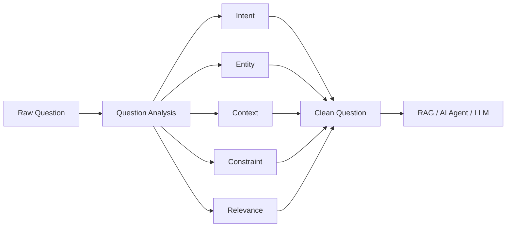
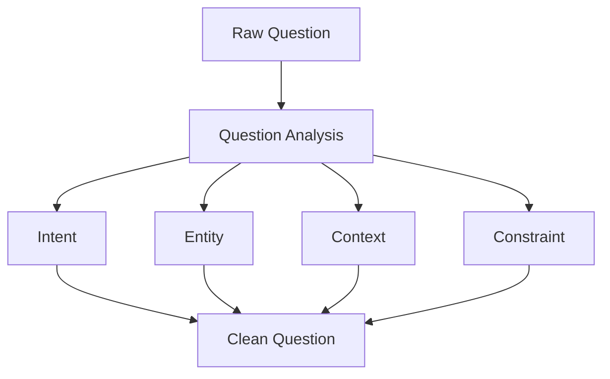
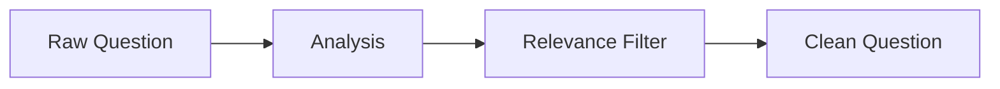
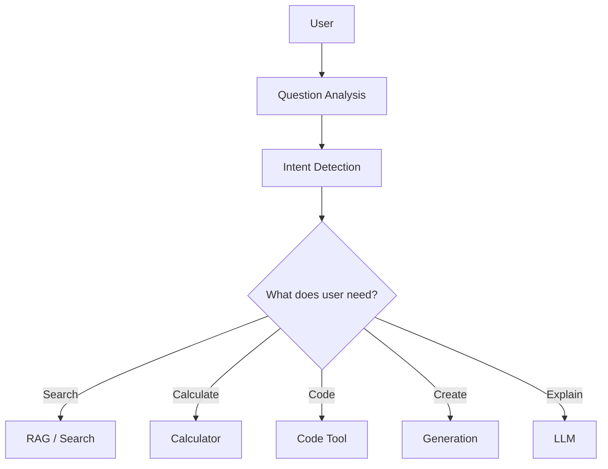
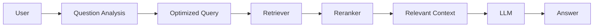
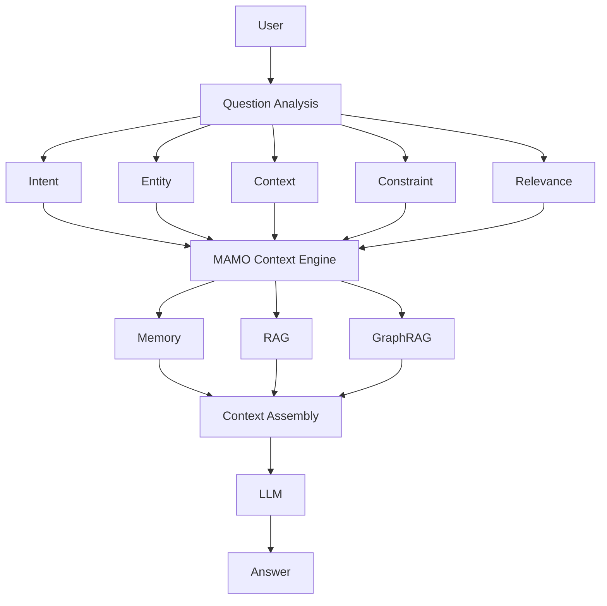
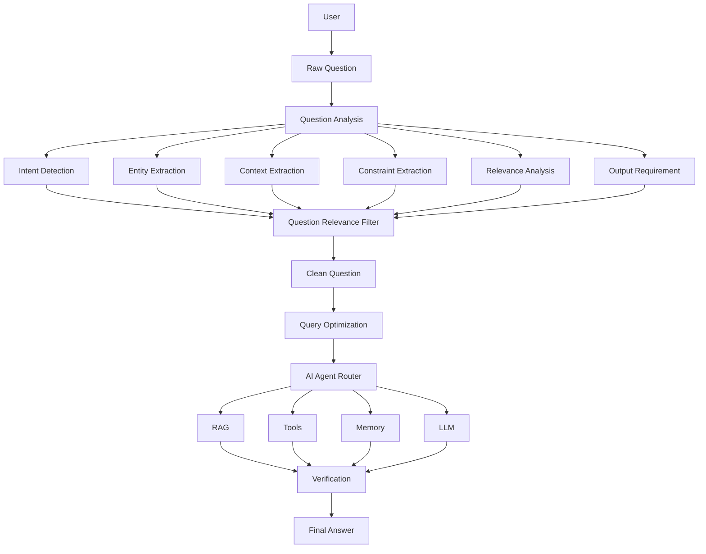

# Analysis Question

**Analysis Question** คือกระบวนการที่ AI Agent นำคำถามดิบของผู้ใช้มาวิเคราะห์ เพื่อทำความเข้าใจว่า **ผู้ใช้ต้องการอะไร มีข้อมูลสำคัญอะไร มีเงื่อนไขอะไร และข้อมูลส่วนใดไม่เกี่ยวข้อง** ก่อนสร้าง `Clean Question` และส่งต่อไปยัง RAG, Tool หรือ LLM

พูดง่าย ๆ:

> **Analysis Question = ขั้นตอนทำความเข้าใจคำถามก่อนลงมือค้นหา คิด หรือทำงาน**

---

## 1. Question Analysis Pipeline



---

# 2. สิ่งที่ Analysis Question ต้องวิเคราะห์

สามารถแบ่งเป็น 6 ส่วนหลัก:

```text
Question Analysis
│
├── Intent
├── Entity
├── Context
├── Constraint
├── Relevance
└── Expected Output
```

### 1. Intent

ผู้ใช้ต้องการอะไร?

```text
Explain
Compare
Search
Create
Analyze
Summarize
Translate
Solve
Generate
```

### 2. Entity

กำลังพูดถึงอะไร?

```text
Python
MySQL
RAG
LLM
Software Architecture
```

### 3. Context

มีบริบทอะไรที่ช่วยให้ตอบได้ดีขึ้น?

```text
ผู้เริ่มต้น
ระดับมหาวิทยาลัย
ใช้สำหรับโปรเจกต์
ต้องการตัวอย่าง
```

### 4. Constraint

มีข้อจำกัดอะไร?

```text
Python 3.12
ใช้ MySQL
เขียนเป็น Markdown
ไม่เกิน 1,000 คำ
```

### 5. Relevance

ข้อมูลไหนเกี่ยวข้องหรือไม่เกี่ยวข้อง?

```text
CORE
CONTEXT
NOISE
```

### 6. Expected Output

ผู้ใช้ต้องการผลลัพธ์แบบไหน?

```text
บทความ
โค้ด
ตาราง
Diagram
Markdown
JSON
```

---

# 3. ตัวอย่าง Analysis Question

### Raw Question

```text
ผมกำลังเรียน Software Engineering อยู่ครับ
ตอนนี้ทำโปรเจกต์ Python และอยากทำระบบ AI Agent
แต่ยังไม่ค่อยเข้าใจว่า RAG กับ GraphRAG ต่างกันอย่างไร
อาจารย์อยากให้ทำเป็นบทความ Markdown พร้อม Diagram
และขอให้ยกตัวอย่างง่าย ๆ สำหรับนักศึกษา
```

Analysis:

```json
{
  "intent": "compare",
  "entities": [
    "RAG",
    "GraphRAG",
    "AI Agent"
  ],
  "context": [
    "นักศึกษา",
    "ผู้เริ่มต้น"
  ],
  "constraints": [
    "Markdown",
    "มี Diagram",
    "มีตัวอย่าง"
  ],
  "noise": [
    "กำลังทำโปรเจกต์ Python"
  ],
  "expected_output": [
    "บทความ",
    "Comparison",
    "Diagram",
    "Example"
  ]
}
```

---

# 4. Analysis → Clean Question

หลังจากวิเคราะห์แล้ว Agent จึงสร้าง `Clean Question`



ผลลัพธ์:

```text
เปรียบเทียบ RAG และ GraphRAG
อธิบายความแตกต่าง ข้อดี ข้อเสีย
พร้อมตัวอย่างง่าย ๆ สำหรับนักศึกษา
เขียนในรูปแบบ Markdown และมี Diagram
```

---

# 5. Analysis Question กับ Question Relevance Filter

สองส่วนนี้ทำงานต่อเนื่องกัน:

```text
Raw Question
      ↓
Question Analysis
      ↓
Question Relevance Filter
      ↓
Clean Question
```

หรือ:



**Analysis** = ทำความเข้าใจข้อมูล

**Filter** = ตัดข้อมูลที่ไม่เกี่ยวข้อง

**Clean Question** = สร้างคำถามที่ผ่านการคัดกรองแล้ว

---

# 6. Analysis Question กับ AI Agent

ใน AI Agent ขั้นตอนนี้สำคัญมาก เพราะ Agent ไม่ควรรีบเรียก Tool ทันที



ดังนั้น:

> **Question Analysis เป็นตัวช่วยให้ Agent เลือก “จะทำอะไรต่อ”**

---

# 7. Analysis Question + RAG



ถ้าไม่วิเคราะห์คำถามก่อน:

```text
Raw Question
 ↓
Retriever
 ↓
Noise
 ↓
Wrong Context
 ↓
LLM
 ↓
Poor Answer
```

แต่ถ้าวิเคราะห์ก่อน:

```text
Raw Question
 ↓
Analysis
 ↓
Clean Question
 ↓
Optimized Query
 ↓
Relevant Retrieval
 ↓
LLM
 ↓
Better Answer
```

---

# 8. Analysis Question + MAMO

สำหรับ **MAMO Context Engineering** สามารถกำหนดเป็น Layer แรก:



---

# 9. Python Prototype

```python
class QuestionAnalyzer:

    def analyze(self, question):

        result = {
            "raw_question": question,
            "intent": None,
            "entities": [],
            "context": [],
            "constraints": [],
            "expected_output": []
        }

        text = question.lower()

        # Intent
        if "เปรียบเทียบ" in question:
            result["intent"] = "compare"
        elif "คืออะไร" in question:
            result["intent"] = "explain"
        elif "สร้าง" in question:
            result["intent"] = "create"
        else:
            result["intent"] = "unknown"

        # Entities
        entities = [
            "RAG",
            "GraphRAG",
            "AI Agent",
            "Python",
            "MySQL"
        ]

        for entity in entities:
            if entity.lower() in text:
                result["entities"].append(entity)

        # Output format
        if "Markdown" in question:
            result["expected_output"].append("Markdown")

        if "Diagram" in question:
            result["expected_output"].append("Diagram")

        if "ตัวอย่าง" in question:
            result["expected_output"].append("Example")

        return result
```

---

# 10. Agent State

ในระบบจริงควรเก็บผล Analysis เป็น State:

```json
{
  "raw_question": "...",

  "analysis": {
    "intent": "compare",

    "entities": [
      "RAG",
      "GraphRAG"
    ],

    "context": [
      "beginner",
      "student"
    ],

    "constraints": [
      "Markdown",
      "Diagram"
    ],

    "relevance": {
      "core": [],
      "context": [],
      "noise": []
    },

    "expected_output": [
      "article",
      "diagram",
      "example"
    ]
  }
}
```

---

# 11. Complete Question Understanding Architecture



---

# 12. สรุปความสัมพันธ์

```text
Raw Question
      ↓
Question Analysis
      ↓
┌───────────────────────┐
│ Intent                │
│ Entity                │
│ Context               │
│ Constraint            │
│ Relevance             │
│ Expected Output       │
└───────────────────────┘
      ↓
Question Relevance Filter
      ↓
Clean Question
      ↓
Query Optimization
      ↓
AI Agent Router
      ↓
RAG / Memory / Tools / LLM
      ↓
Verification
      ↓
Final Answer
```

### แนวคิดสำคัญ

| Component              | หน้าที่                                  |
| ---------------------- | ---------------------------------------- |
| **Analysis Question**  | ทำความเข้าใจคำถาม                        |
| **Relevance Filter**   | คัดกรองข้อมูล                            |
| **Clean Question**     | คำถามที่สะอาดและครบ                      |
| **Query Optimization** | ปรับคำถามให้เหมาะกับ Retrieval           |
| **Router**             | เลือกว่าจะใช้ RAG, Tool, Memory หรือ LLM |
| **Verification**       | ตรวจสอบผลลัพธ์                           |

> **Analysis Question คือสมองส่วนแรกของ Pipeline** ที่ช่วยให้ AI Agent เข้าใจว่า *“ผู้ใช้กำลังถามอะไร ต้องใช้อะไร และควรทำอะไรต่อ”* ก่อนเข้าสู่ Context Engineering, RAG และ LLM.
