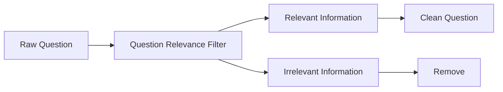
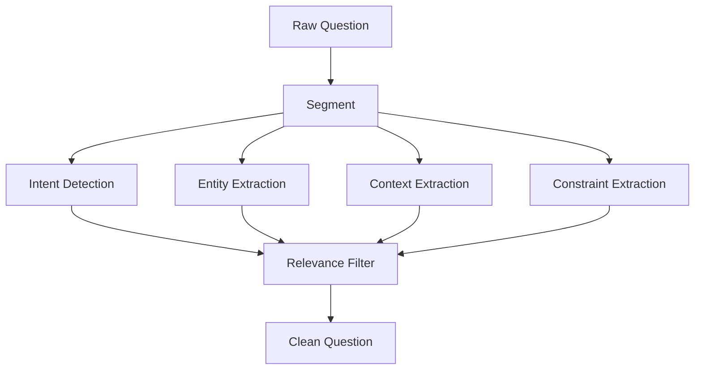
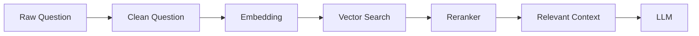
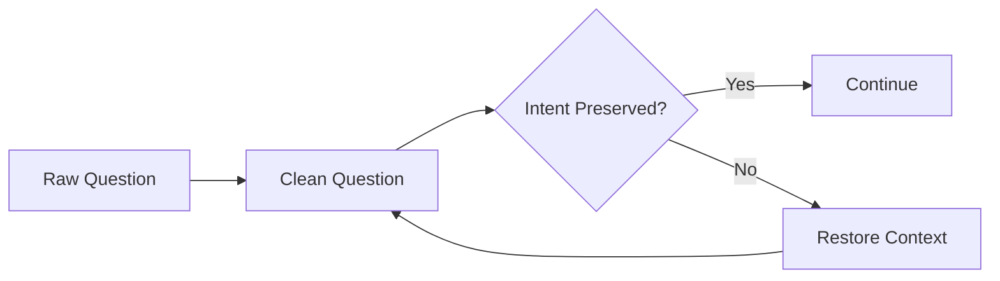
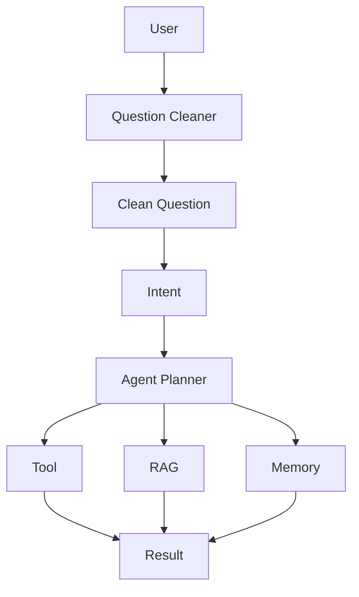
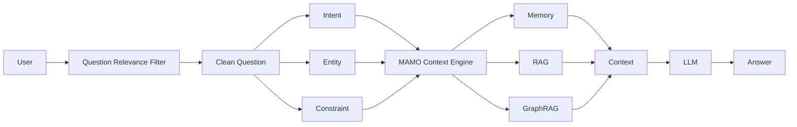

# Clean Question

**Clean Question** คือ **คำถามที่ผ่านการทำความสะอาดและคัดกรองข้อมูลแล้ว** โดยตัดข้อมูลที่ไม่เกี่ยวข้อง (Noise) ออก แต่ยังคง **Intent, Entity, Context และ Constraint ที่จำเป็น** เพื่อให้ LLM, RAG หรือ AI Agent เข้าใจคำถามได้แม่นยำขึ้น

> **Clean Question = Original Question − Irrelevant Information + Necessary Context**

---

## 1. แนวคิดหลัก



---

## 2. ตัวอย่าง

### Raw Question

```text
ผมกำลังเรียน Software Engineering อยู่ครับ
ตอนนี้กำลังทำโปรเจกต์ Python และเมื่อวานอาจารย์พูดถึง
Microservices แต่ผมยังไม่ค่อยเข้าใจ
เพื่อนผมก็บอกว่ามันซับซ้อนมาก
ช่วยอธิบายว่า Microservices Architecture คืออะไร
และมีข้อดีข้อเสียอะไรบ้างครับ
```

### วิเคราะห์

```text
CORE
✓ Microservices Architecture
✓ ความหมาย
✓ ข้อดี
✓ ข้อเสีย

CONTEXT
✓ ยังไม่เข้าใจ
✓ ต้องการคำอธิบาย

NOISE
✗ กำลังทำโปรเจกต์ Python
✗ เมื่อวานอาจารย์พูด
✗ เพื่อนบอกว่าซับซ้อน
```

### Clean Question

```text
Microservices Architecture คืออะไร?
อธิบายความหมาย พร้อมข้อดีและข้อเสีย
สำหรับผู้เริ่มต้น
```

---

# 3. Clean Question Structure

Clean Question ที่ดีควรประกอบด้วย:

```text
Clean Question
│
├── Intent
│
├── Entity
│
├── Context
│
├── Constraint
│
└── Task
```

ตัวอย่าง:

```json
{
  "intent": "learn",
  "entity": "Microservices Architecture",
  "context": "beginner",
  "constraint": null,
  "task": "explain advantages and disadvantages"
}
```

จากนั้นสร้าง:

```text
Clean Question
↓
"Explain Microservices Architecture,
including its advantages and disadvantages
for a beginner."
```

---

# 4. Raw Question → Clean Question



---

# 5. ตัวอย่างสำหรับ RAG

### Raw Question

```text
ผมเรียน Database อยู่ครับ
อาจารย์ให้ทำงานเกี่ยวกับฐานข้อมูล
เมื่อวานผมลองใช้ MySQL แล้วเจอปัญหา
แต่ตอนนี้อยากรู้ว่า Normalization คืออะไร
โดยเฉพาะ 1NF, 2NF และ 3NF
ช่วยอธิบายพร้อมตัวอย่างหน่อยครับ
```

### Clean Question

```text
อธิบาย Database Normalization
โดยเฉพาะ 1NF, 2NF และ 3NF
พร้อมตัวอย่าง
```

จากนั้นส่งไป RAG:



---

# 6. Clean Question ไม่เท่ากับ Short Question

นี่เป็นจุดสำคัญมาก

### ❌ Short Question

```text
Normalization คืออะไร?
```

อาจสั้นเกินไป เพราะเสียรายละเอียด

### ✅ Clean Question

```text
อธิบาย Database Normalization
โดยเปรียบเทียบ 1NF, 2NF และ 3NF
พร้อมตัวอย่าง
```

ดังนั้น:

```text
Short ≠ Clean
```

แต่:

```text
Clean = Relevant + Complete + Concise
```

---

# 7. Intent Preservation

Clean Question ต้อง **รักษาความหมายเดิม**



ตัวอย่าง:

```text
Raw:
"ผมอยากรู้ว่า Python กับ Java ต่างกันอย่างไร
สำหรับการพัฒนา AI"

Clean:
"เปรียบเทียบ Python กับ Java
สำหรับการพัฒนา AI"
```

ถูกต้อง เพราะ Intent ยังเหมือนเดิม

---

# 8. Constraint Preservation

บางข้อมูลดูเหมือนเป็นรายละเอียด แต่จริง ๆ **ห้ามตัด**

ตัวอย่าง:

```text
เขียน Python สำหรับ Python 3.12
ใช้ FastAPI
และต้องทำงานบน macOS
```

Clean Question:

```text
เขียน Python 3.12 + FastAPI
สำหรับใช้งานบน macOS
```

ต้องเก็บ:

```text
Python 3.12
FastAPI
macOS
```

เพราะเป็น **Constraints**

---

# 9. Clean Question สำหรับ AI Agent



Agent จึงทำงานจากคำถามที่มีคุณภาพมากขึ้น

---

# 10. Clean Question ใน MAMO

สำหรับ **MAMO Context Engineering** สามารถกำหนด Pipeline ได้:



---

# 11. Python Prototype

```python
class CleanQuestion:
    def __init__(
        self,
        raw_question,
        intent,
        entities,
        context,
        constraints,
        clean_question
    ):
        self.raw_question = raw_question
        self.intent = intent
        self.entities = entities
        self.context = context
        self.constraints = constraints
        self.clean_question = clean_question

    def result(self):
        return {
            "intent": self.intent,
            "entities": self.entities,
            "context": self.context,
            "constraints": self.constraints,
            "clean_question": self.clean_question
        }


question = CleanQuestion(
    raw_question="ผมกำลังเรียน Database และอยากรู้ว่า 1NF 2NF 3NF คืออะไร",
    intent="explain",
    entities=["Database Normalization", "1NF", "2NF", "3NF"],
    context=["beginner"],
    constraints=[],
    clean_question="อธิบาย 1NF, 2NF และ 3NF พร้อมตัวอย่าง"
)

print(question.result())
```

---

# 12. Quality Criteria

Clean Question ที่ดีควรมี 5 คุณสมบัติ:

| คุณสมบัติ             | ความหมาย                   |
| --------------------- | -------------------------- |
| **Relevant**          | มีเฉพาะข้อมูลที่เกี่ยวข้อง |
| **Complete**          | มีข้อมูลสำคัญครบ           |
| **Concise**           | กระชับ                     |
| **Intent-Preserving** | ไม่เปลี่ยนความต้องการ      |
| **Context-Aware**     | ไม่ตัด Context ที่จำเป็น   |

สรุปเป็น:

```text
Clean Question
       =
Relevant
+ Complete
+ Concise
+ Intent Preserved
+ Context Preserved
```

---

# 13. ตำแหน่งใน Context Engineering

```text
User
 ↓
Raw Question
 ↓
Question Relevance Filter
 ↓
Clean Question
 ↓
Intent / Entity / Constraint
 ↓
Query Optimization
 ↓
Memory Retrieval
 ↓
RAG
 ↓
GraphRAG
 ↓
Reranking
 ↓
Context Assembly
 ↓
Context Compression
 ↓
LLM
 ↓
Answer
```

## สรุป

**Clean Question** ไม่ได้หมายถึงการทำให้คำถามสั้นลงอย่างเดียว แต่คือการสร้าง **คำถามเวอร์ชันที่มี Signal สูงและ Noise ต่ำ** โดยยังรักษาเจตนาและข้อกำหนดสำคัญของผู้ใช้ไว้ครบถ้วน

> **Raw Question → Filter → Clean Question → Optimized Query → RAG/Agent → LLM**

นี่จึงเป็น Component สำคัญสำหรับ **MAMO Context Engineering** เพราะเป็นด่านแรกในการควบคุมคุณภาพของ Context ก่อนที่ข้อมูลจะเข้าสู่ Retrieval และ LLM.
