# Episodic Memory

**Episodic Memory** คือความจำที่เก็บ **เหตุการณ์ ประสบการณ์ และลำดับการทำงานที่เกิดขึ้นในอดีต** ของ AI Agent เพื่อให้สามารถนำประสบการณ์เหล่านั้นกลับมาใช้ในการตัดสินใจครั้งต่อไป

ในบริบทของ **AI Agent / Context Engineering** สามารถเข้าใจง่าย ๆ ว่า:

> **Episodic Memory = จำว่า “เกิดอะไรขึ้น → ทำอะไร → ผลเป็นอย่างไร → เรียนรู้อะไร”**

---

# 1. Episodic Memory ต่างจาก Question Memory อย่างไร?

```text
Question Memory
→ จำว่า "ผู้ใช้เคยถามอะไร"

Episodic Memory
→ จำว่า "ในครั้งนั้นเกิดอะไรขึ้น และ Agent ทำอะไร"
```

ตัวอย่าง:

```text
Question Memory:
"ผู้ใช้ถามวิธีสร้าง RAG"

Episodic Memory:
"ผู้ใช้ถามวิธีสร้าง RAG
→ Agent แนะนำ PostgreSQL + pgvector
→ ผู้ใช้เลือกใช้ PostgreSQL
→ ทดลองแล้ว Retrieval ช้า
→ Agent ปรับ Top-K จาก 10 เป็น 5
→ ผลลัพธ์ดีขึ้น"
```

Episodic Memory จึงเก็บ **ประสบการณ์ทั้ง Episode** ไม่ใช่แค่ข้อความคำถาม

---

# 2. โครงสร้าง Episodic Memory

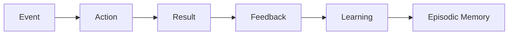

รูปแบบพื้นฐาน:

```text
Event
 ↓
Action
 ↓
Observation
 ↓
Result
 ↓
Feedback
 ↓
Learning
```

---

# 3. ตัวอย่าง AI Agent

สมมติผู้ใช้สั่ง:

```text
สร้างระบบ RAG สำหรับเอกสาร PDF
```

Agent ดำเนินการ:

```text
Episode E001

1. รับคำถาม
2. วิเคราะห์ Requirement
3. เลือก PDF Parser
4. Chunk เอกสาร
5. สร้าง Embedding
6. บันทึก Vector
7. Retrieval
8. สร้างคำตอบ
```

Episodic Memory:

```json id="zz3j8c"
{
  "episode_id": "E001",

  "goal": "สร้างระบบ RAG สำหรับ PDF",

  "events": [
    {
      "step": 1,
      "action": "analyze_requirement"
    },
    {
      "step": 2,
      "action": "parse_pdf"
    },
    {
      "step": 3,
      "action": "chunk_document"
    },
    {
      "step": 4,
      "action": "create_embedding"
    },
    {
      "step": 5,
      "action": "retrieve_context"
    }
  ],

  "result": "success",

  "learning": [
    "ใช้ chunk size 500 tokens",
    "ใช้ top_k = 5"
  ]
}
```

---

# 4. Episodic Memory Architecture

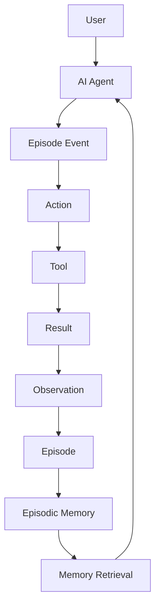

Agent สามารถนำประสบการณ์เก่ากลับมาใช้:

```text
Previous Episode
       ↓
Retrieve
       ↓
Relevant Experience
       ↓
Current Planning
       ↓
Better Action
```

---

# 5. Episodic Memory vs Semantic Memory

สองอย่างนี้สำคัญมากใน AI Agent

| Episodic Memory | Semantic Memory |
| --------------- | --------------- |
| จำเหตุการณ์     | จำความรู้       |
| จำประสบการณ์    | จำข้อเท็จจริง   |
| จำลำดับการทำงาน | จำ Concept      |
| จำ Action       | จำ Entity       |
| จำ Result       | จำ Relationship |
| "เกิดอะไรขึ้น"  | "รู้อะไร"       |

ตัวอย่าง:

### Semantic Memory

```text
RAG = Retrieval-Augmented Generation
```

### Episodic Memory

```text
ครั้งก่อน Agent สร้าง RAG
โดยใช้ PostgreSQL + pgvector
และประสบความสำเร็จ
```

---

# 6. Episodic Memory vs Question Memory

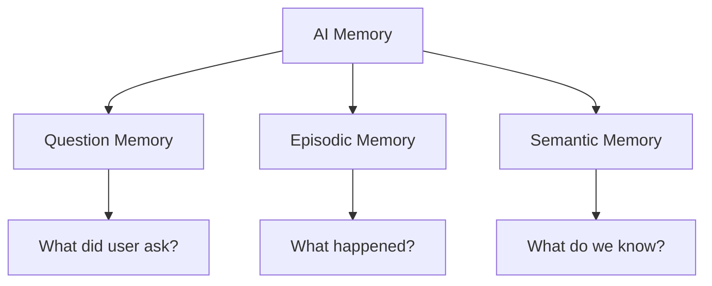

สรุป:

```text
Question Memory
→ What was asked?

Episodic Memory
→ What happened?

Semantic Memory
→ What do we know?
```

---

# 7. Episodic Memory ใน AI Agent

จุดเด่นของ Episodic Memory คือช่วยให้ Agent **เรียนรู้จากประสบการณ์**

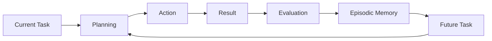

เช่น:

```text
ครั้งที่ 1
→ Tool A ล้มเหลว

ครั้งที่ 2
→ Agent จำ Episode เดิม

ครั้งที่ 2
→ หลีกเลี่ยง Tool A
→ ใช้ Tool B

ผล:
→ ทำงานสำเร็จเร็วขึ้น
```

---

# 8. Episode Schema

สามารถออกแบบข้อมูล:

```json id="mrlr1e"
{
  "episode_id": "ep_001",

  "session_id": "session_123",

  "goal": "สร้างระบบ RAG",

  "start_time": "2026-08-27T08:00:00",

  "end_time": "2026-08-27T08:15:00",

  "events": [],

  "actions": [],

  "observations": [],

  "tools_used": [],

  "result": "success",

  "feedback": "good",

  "lessons": [],

  "importance": 0.91
}
```

---

# 9. Event Model

Episode หนึ่งประกอบด้วยหลาย Event:

```json id="9p3k0k"
{
  "event_id": "event_003",

  "type": "tool_call",

  "tool": "vector_search",

  "input": {
    "query": "GraphRAG architecture"
  },

  "output": {
    "documents": 5
  },

  "status": "success",

  "timestamp": "2026-08-27T08:08:00"
}
```

---

# 10. Episode Graph

Episodic Memory สามารถสร้างเป็น Graph ได้:

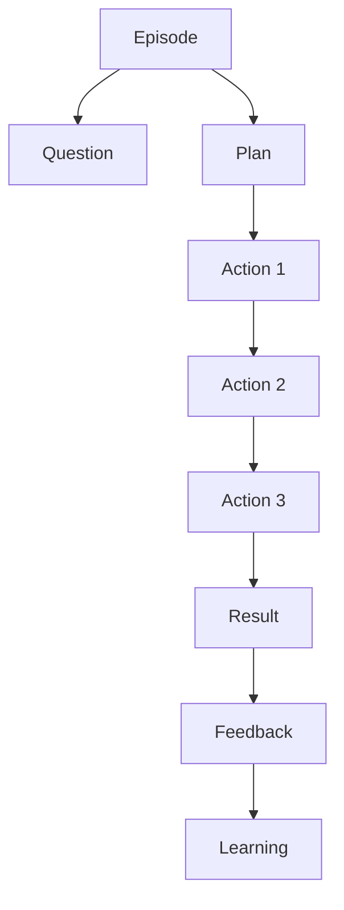

ทำให้เห็น:

```text
Question
 ↓
Plan
 ↓
Action
 ↓
Result
 ↓
Feedback
 ↓
Learning
```

---

# 11. Episodic Memory + RAG

สามารถนำประสบการณ์เดิมมาช่วย RAG:

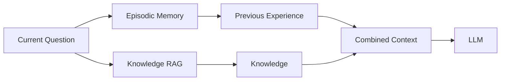

ดังนั้น LLM ได้ทั้ง:

```text
Knowledge
+
Experience
```

---

# 12. Episodic Memory + Question Memory

สองระบบสามารถทำงานร่วมกัน:

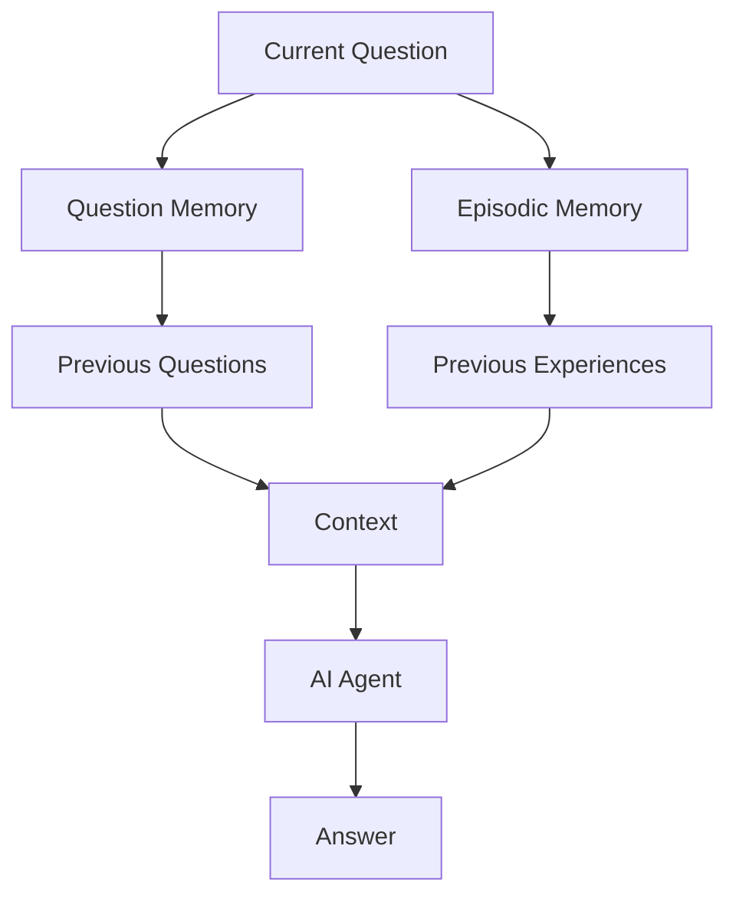

ตัวอย่าง:

```text
Question Memory:
ผู้ใช้เคยถามเรื่อง RAG

Episodic Memory:
ผู้ใช้เคยสร้าง RAG ด้วย pgvector
และพบปัญหา Retrieval

Current Question:
"ครั้งนี้ควรใช้ Vector DB ตัวไหนดี?"
```

Agent สามารถนำประสบการณ์เก่ามาประกอบการตอบ

---

# 13. Episodic Memory + MAMO

สำหรับ **MAMO Context Engineering** สามารถวาง Episodic Memory ใน Memory Layer:

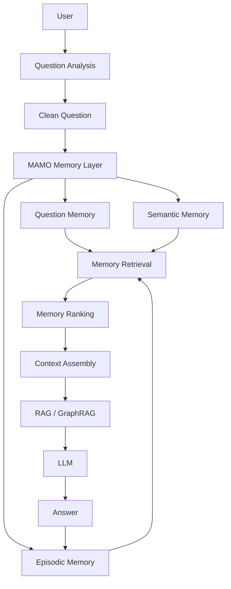

---

# 14. Memory Lifecycle

```text
id="j0j7da"
Experience
   ↓
Capture
   ↓
Store
   ↓
Index
   ↓
Retrieve
   ↓
Evaluate
   ↓
Learn
   ↓
Update
```

หรือ:

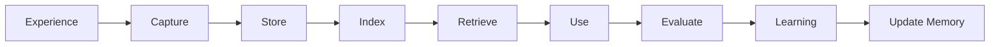

---

# 15. Python Prototype

```python id="avh9v4"
from dataclasses import dataclass, field
from datetime import datetime


@dataclass
class Episode:
    episode_id: str
    goal: str

    events: list = field(default_factory=list)

    result: str = ""
    feedback: str = ""

    lessons: list = field(default_factory=list)

    created_at: str = field(
        default_factory=lambda: datetime.now().isoformat()
    )


class EpisodicMemory:

    def __init__(self):
        self.episodes = []

    def save(self, episode):
        self.episodes.append(episode)

    def retrieve(self, keyword):
        results = []

        for episode in self.episodes:
            if (
                keyword.lower()
                in episode.goal.lower()
            ):
                results.append(episode)

        return results


episode = Episode(
    episode_id="ep_001",
    goal="สร้างระบบ RAG"
)

episode.events.append({
    "action": "create_embedding",
    "result": "success"
})

episode.events.append({
    "action": "vector_search",
    "result": "success"
})

episode.result = "success"

episode.lessons = [
    "ใช้ chunk ขนาด 500 tokens",
    "ใช้ top_k = 5"
]


memory = EpisodicMemory()

memory.save(episode)

results = memory.retrieve("RAG")

for item in results:
    print(item.goal)
    print(item.lessons)
```

---

# 16. Production Architecture

ระบบจริงสามารถออกแบบเป็น:

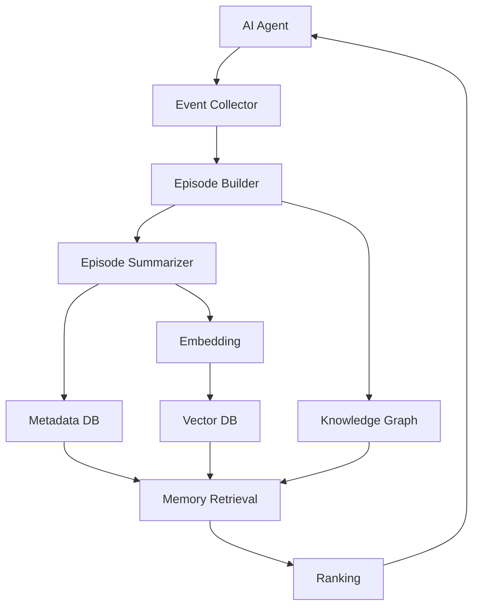

---

# 17. สิ่งที่ควรเก็บใน Episodic Memory

ไม่จำเป็นต้องเก็บทุก Event แบบละเอียดตลอดไป

ควรเน้น:

```text
✓ Goal
✓ Important Actions
✓ Tool Used
✓ Important Observation
✓ Result
✓ Error
✓ Feedback
✓ Decision
✓ Lesson Learned
```

และลด:

```text
✗ Debug log ที่ไม่สำคัญ
✗ ข้อความซ้ำ
✗ Token ที่ไม่มีประโยชน์
✗ Noise
```

---

# 18. Episodic Memory สำหรับ Agent Learning

แนวคิดสำคัญที่สุด:

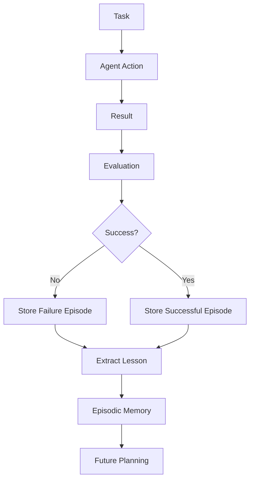

Agent จึงสามารถเรียนรู้ทั้ง:

```text
Successful Experience
```

และ

```text
Failure Experience
```

---

# 19. Failure Memory

ส่วนนี้มีประโยชน์มากสำหรับ AI Agent

ตัวอย่าง:

```json id="7uhp0b"
{
  "episode_id": "ep_021",

  "goal": "สร้าง RAG",

  "action": "retrieve_documents",

  "result": "failure",

  "error": "retrieval returned irrelevant documents",

  "cause": "query too broad",

  "lesson": "perform query optimization before retrieval"
}
```

ครั้งต่อไป:

```text
User Question
      ↓
Question Analysis
      ↓
Agent จำ Failure Episode
      ↓
Query Optimization
      ↓
RAG
```

นี่ทำให้ Agent ไม่เพียง **จำสิ่งที่เคยทำ** แต่สามารถ **หลีกเลี่ยงความผิดพลาดเดิม**

---

# 20. สรุปใน MAMO Context Engineering

```text
                    MAMO
                     │
             Context Engineering
                     │
        ┌────────────┴────────────┐
        │                         │
     Question                  Memory
     Analysis                    │
        │              ┌─────────┼─────────┐
        │              │         │         │
     Clean Q       Question   Semantic  Episodic
                    Memory     Memory    Memory
                                         │
                                      Experience
                                         │
                                  Action + Result
                                         │
                                      Learning
```

### จำง่าย ๆ

```text
Question Memory
→ จำว่า "ถามอะไร"

Semantic Memory
→ จำว่า "รู้อะไร"

Episodic Memory
→ จำว่า "เคยเกิดอะไรขึ้น"

Working Memory
→ จำว่า "กำลังทำอะไรอยู่"
```

ดังนั้นใน **AI Agent Architecture** นั้น `Episodic Memory` มีบทบาทสำคัญมาก เพราะเป็นสะพานจาก **Experience → Learning → Future Decision** ทำให้ Agent มีความสามารถในการนำประสบการณ์เดิมมาใช้วางแผนงานใหม่ แก้ปัญหาเดิม และหลีกเลี่ยงความผิดพลาดที่เคยเกิดขึ้น.
