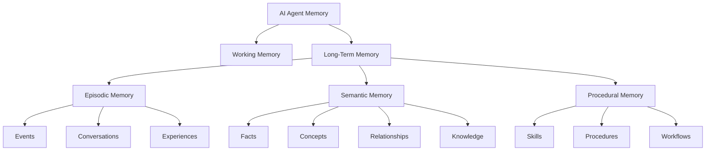
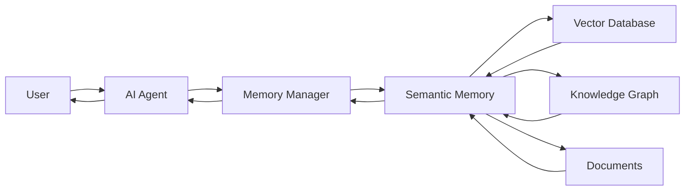
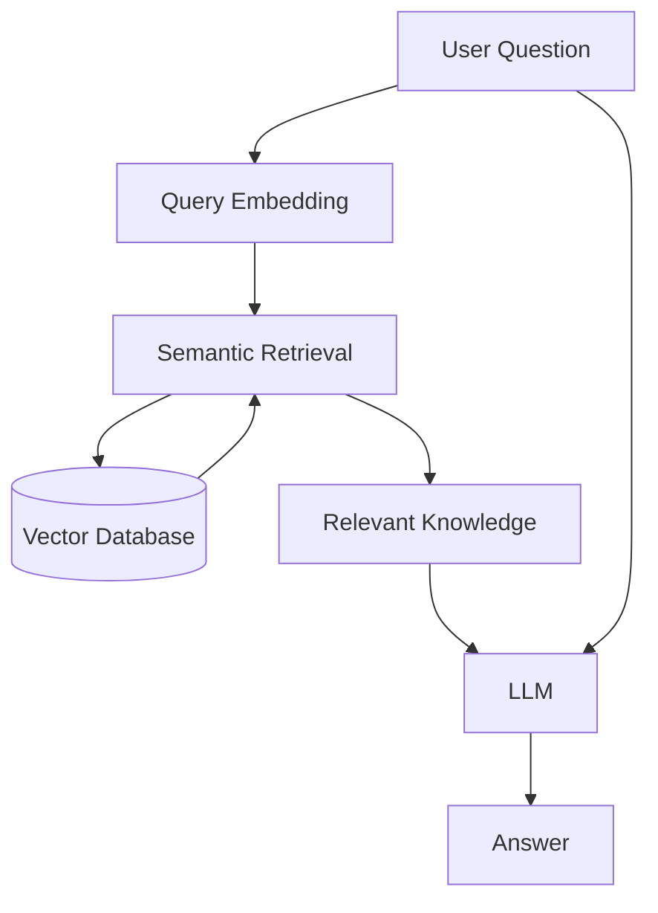
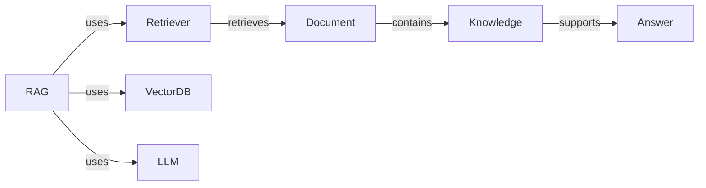
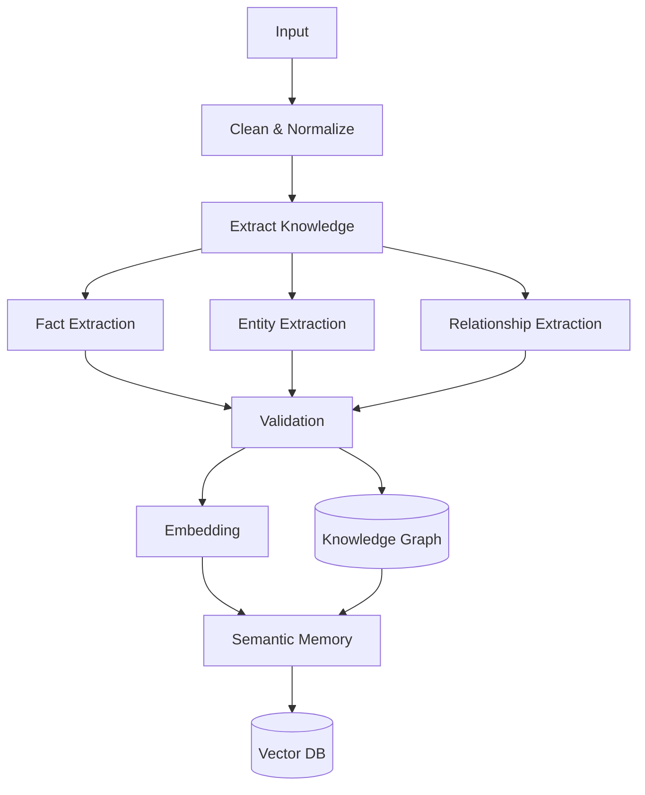
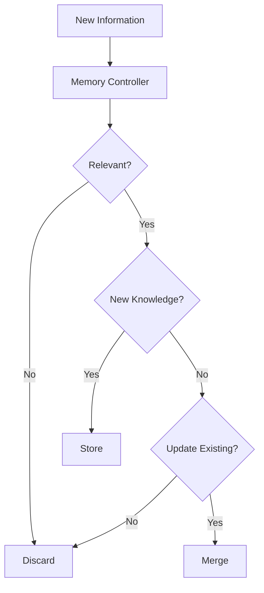
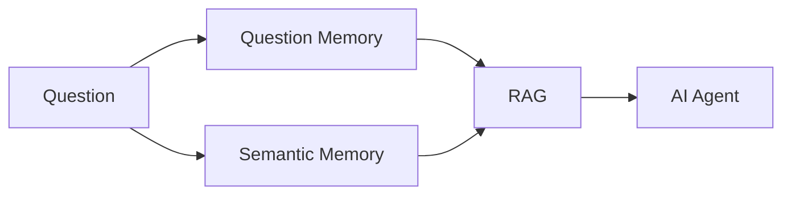
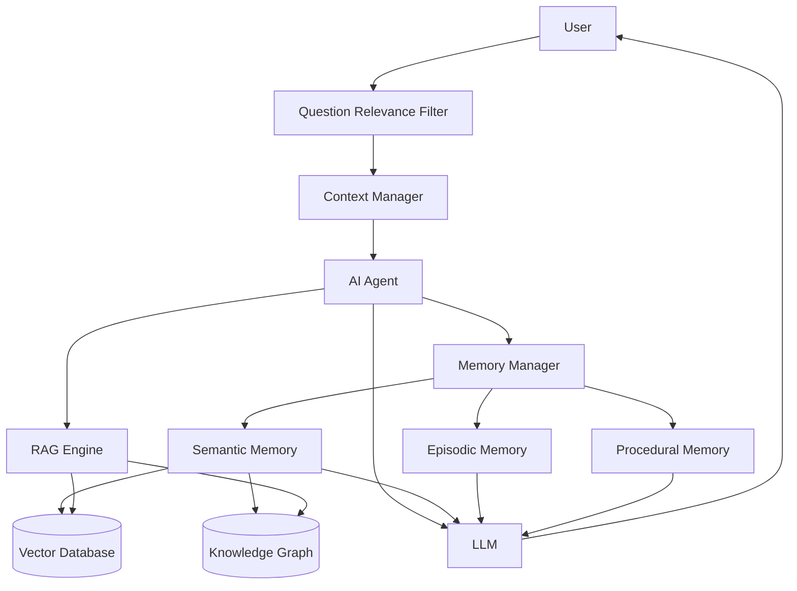

# Semantic Memory

**Semantic Memory** คือหน่วยความจำของ AI Agent ที่ใช้เก็บ **“ความรู้ ข้อเท็จจริง แนวคิด และความสัมพันธ์ของข้อมูล”** ที่เรียนรู้หรือได้รับมา โดยไม่จำเป็นต้องจำลำดับเหตุการณ์ว่าเกิดขึ้นเมื่อใด

พูดง่าย ๆ คือ

> **Episodic Memory = จำว่า “เกิดอะไรขึ้น”**
> **Semantic Memory = จำว่า “รู้อะไร”**

---

## 1. Semantic Memory คืออะไร?

Semantic Memory เป็นรูปแบบหนึ่งของ **Long-Term Memory** ที่เก็บความรู้ในลักษณะที่สามารถนำกลับมาใช้กับคำถามหรือสถานการณ์ใหม่ได้

ตัวอย่างเช่น AI Agent เรียนรู้ว่า:

```text
Python เป็นภาษาโปรแกรม
Python เหมาะกับงาน Data Science
Python มี Library เช่น NumPy, Pandas และ PyTorch
```

เมื่อผู้ใช้ถามในอนาคตว่า

> “ภาษาอะไรเหมาะกับการทำ Machine Learning?”

Agent สามารถนำความรู้เหล่านี้มา reasoning ได้ แม้ว่าจะไม่ได้จำว่า **ความรู้นี้ถูกเรียนรู้มาจาก conversation ไหน**

---

# 2. Semantic Memory vs Episodic Memory

| ประเภท                | สิ่งที่จำ            | ตัวอย่าง                             |
| --------------------- | -------------------- | ------------------------------------ |
| **Episodic Memory**   | เหตุการณ์            | ผู้ใช้ถามเรื่อง RAG เมื่อวาน         |
| **Semantic Memory**   | ความรู้/ข้อเท็จจริง  | RAG ใช้ Retrieval เพื่อค้น Knowledge |
| **Working Memory**    | ข้อมูลที่กำลังใช้งาน | Context ของคำถามปัจจุบัน             |
| **Procedural Memory** | วิธีการทำงาน         | ขั้นตอนสร้าง RAG Pipeline            |

สามารถมองเป็น Memory Architecture ได้ดังนี้



---

# 3. Semantic Memory ใน AI Agent

ในระบบ AI Agent สามารถออกแบบ Semantic Memory เป็น **Knowledge Layer** ที่อยู่ระหว่าง Agent กับ Knowledge Sources



แนวคิดสำคัญคือ **Semantic Memory ไม่จำเป็นต้องเท่ากับ Vector Database**

Vector Database เป็นเพียง **Storage / Retrieval Mechanism** หนึ่งของ Semantic Memory

---

# 4. Semantic Memory เก็บอะไร?

Semantic Memory สามารถเก็บข้อมูลได้หลายประเภท เช่น

### Facts

```text
Python เป็น Programming Language
RAG ย่อมาจาก Retrieval-Augmented Generation
```

### Concepts

```text
RAG
AI Agent
LLM
Vector Database
Knowledge Graph
```

### Relationships

```text
RAG
 ├── uses → Retriever
 ├── uses → Vector Database
 └── uses → LLM
```

### User Knowledge

ตัวอย่าง:

```text
User prefers Markdown documentation.
User frequently works with AI Agent architecture.
```

### Domain Knowledge

เช่นระบบ AI Agent สำหรับมหาวิทยาลัย:

```text
Course
 ├── has → Lesson
 ├── has → Assignment
 └── has → Exam
```

---

# 5. Semantic Memory + Embedding

หนึ่งในวิธีที่นิยมคือการแปลงความรู้เป็น **Embedding Vector**

```text
Knowledge
     ↓
Text Chunk
     ↓
Embedding Model
     ↓
Vector
     ↓
Vector Database
```

ตัวอย่าง:

```text
"RAG combines retrieval with generation."
```

อาจถูกแปลงเป็น:

```text
[0.021, -0.182, 0.734, ..., 0.091]
```

เมื่อผู้ใช้ถาม:

```text
"RAG ทำงานอย่างไร?"
```

ระบบจะสร้าง Query Embedding แล้วค้นหาความรู้ที่มี semantic similarity สูง



---

# 6. Semantic Memory + Knowledge Graph

อีกวิธีหนึ่งคือใช้ **Knowledge Graph**

แทนที่จะเก็บเพียง Vector สามารถเก็บความสัมพันธ์ระหว่าง Entity ได้



ข้อดีคือ Agent สามารถถามความสัมพันธ์เชิงโครงสร้าง เช่น

> “RAG ใช้เทคโนโลยีอะไรบ้าง?”

ระบบสามารถ Traverse Graph:

```text
RAG
 ├── uses → Retriever
 ├── uses → Vector Database
 └── uses → LLM
```

---

# 7. Semantic Memory Pipeline

Architecture ที่เหมาะกับ AI Agent สามารถออกแบบได้ดังนี้



---

# 8. Memory Update

Semantic Memory ไม่ควรนำข้อมูลทุกอย่างไปเก็บทันที

ควรมี **Memory Controller**



ตรงนี้เชื่อมโยงโดยตรงกับแนวคิด **Question Relevance Filter** ที่คุณกำลังออกแบบอยู่:

```text
Question
   ↓
Question Relevance Filter
   ↓
Clean Question
   ↓
Memory Retrieval
   ↓
Semantic Memory
   ↓
Relevant Knowledge
   ↓
LLM Reasoning
```

---

# 9. Semantic Memory กับ Question Memory

สามารถแยกเป็น 2 ส่วนได้อย่างชัดเจน



**Question Memory** จำเกี่ยวกับคำถามหรือ interaction

เช่น:

```text
User asked about RAG.
User then asked about GraphRAG.
User wants Markdown documentation.
```

ส่วน **Semantic Memory** จำความรู้:

```text
RAG → Retrieval + Generation
GraphRAG → Graph + Retrieval + Generation
Markdown → Lightweight Markup Language
```

---

# 10. Semantic Memory สำหรับ AI Agent Architecture

ถ้าจะออกแบบเป็นระบบใหญ่ สามารถใช้ Architecture นี้ได้:



---

## 11. สรุปแนวคิด

จำง่าย ๆ:

```text
Semantic Memory
      │
      ├── Facts
      ├── Concepts
      ├── Entities
      ├── Relationships
      ├── Domain Knowledge
      └── Learned Knowledge
```

และใน **AI Agent**:

```text
                 AI Agent
                    │
              Memory Manager
                    │
       ┌────────────┼────────────┐
       ↓            ↓            ↓
 Episodic       Semantic      Procedural
 Memory         Memory         Memory
       │            │            │
   Events         Facts        Skills
 Conversations   Concepts      Workflows
 Experiences     Relations     Procedures
```

**หัวใจสำคัญ:**

> **Semantic Memory คือ “ความรู้ระยะยาวของ AI Agent” ที่ทำให้ Agent ไม่เพียงแต่จำว่าเคยเกิดอะไรขึ้น แต่สามารถนำความรู้เดิมไปใช้กับคำถามและสถานการณ์ใหม่ได้**

สำหรับ Architecture ที่คุณกำลังพัฒนา แนวคิดที่น่าสนใจมากคือ **Question Memory → Semantic Memory → Knowledge Graph/Vector Memory → Reasoning → Memory Update** ซึ่งสามารถต่อยอดเป็น **Question Memory Model + Semantic Memory Model + Episodic Memory Model** เป็นชุดเดียวกันได้เลย.
