# LLM Model

**LLM (Large Language Model)** คือโมเดล AI ที่ถูกฝึกด้วยข้อมูลข้อความจำนวนมหาศาล เพื่อเรียนรู้รูปแบบของภาษา ความสัมพันธ์ระหว่างคำ และบริบท แล้วนำความรู้นั้นมาใช้ในการ **เข้าใจ วิเคราะห์ สร้าง และแปลงข้อความ**

## 1. LLM Model Architecture

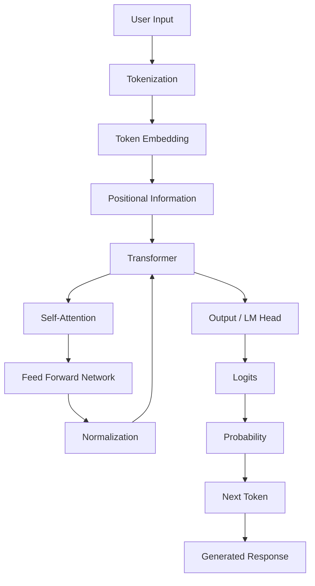

---

# 2. Core Components ของ LLM

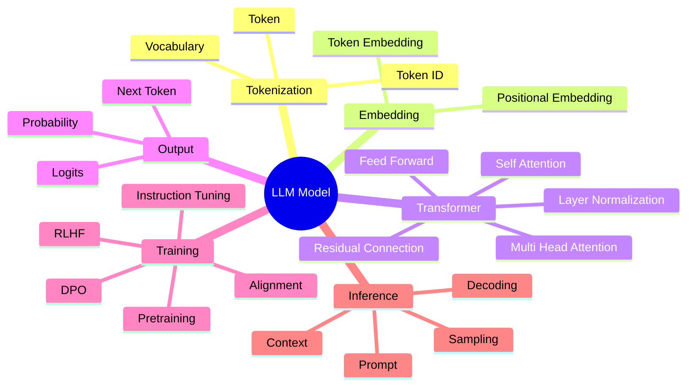

---

# 3. LLM Processing Pipeline

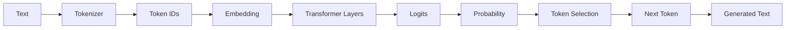

---

# 4. Transformer Architecture

LLM สมัยใหม่จำนวนมากมีพื้นฐานจาก **Transformer Architecture**

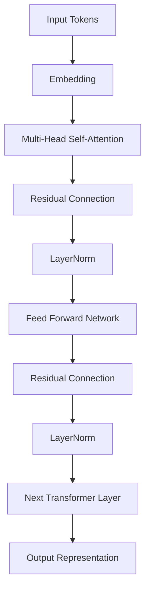

---

# 5. Self-Attention

Self-Attention ช่วยให้โมเดลพิจารณาความสัมพันธ์ระหว่าง Token ต่าง ๆ ใน Context

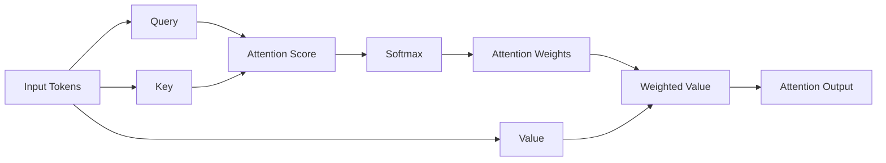

แนวคิดหลักสามารถเขียนเป็น

$$
Attention(Q,K,V)
=
softmax
\left(
\frac{QK^T}{\sqrt{d_k}}
\right)V
$$

---

# 6. LLM Training

การสร้าง LLM โดยทั่วไปมีหลายขั้นตอน

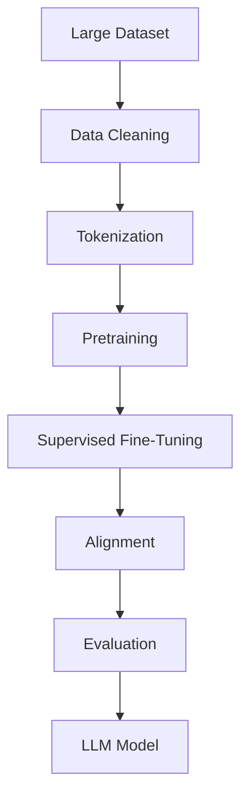

## Pretraining

โมเดลเรียนรู้จากข้อมูลจำนวนมาก โดยภารกิจพื้นฐานของ Decoder-based LLM คือการคาดการณ์ Token ถัดไป

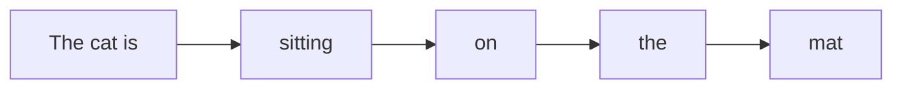

---

# 7. LLM Inference

เมื่อผู้ใช้ส่ง Prompt ให้ LLM

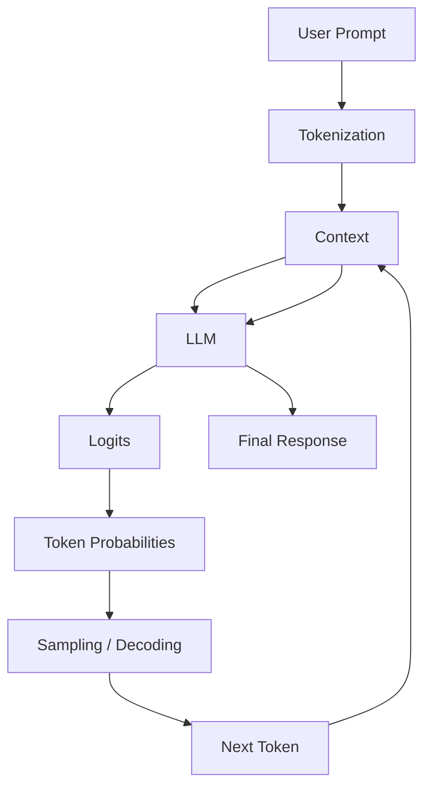

จุดสำคัญคือ LLM ไม่ได้สร้างคำตอบทั้งหมดในครั้งเดียว แต่โดยทั่วไปจะ **สร้าง Token ต่อ Token**

---

# 8. LLM Model Types

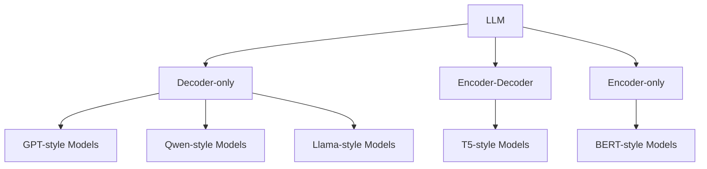

### Decoder-only

เหมาะกับ

* Text Generation
* Chatbot
* Coding
* Reasoning
* AI Agent

### Encoder-Decoder

เหมาะกับ

* Translation
* Summarization
* Text-to-Text Tasks

### Encoder-only

เหมาะกับ

* Classification
* Semantic Representation
* Embedding
* Information Retrieval

---

# 9. LLM Model Lifecycle

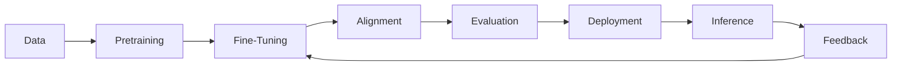

---

# 10. LLM + RAG

LLM สามารถทำงานร่วมกับ **RAG (Retrieval-Augmented Generation)** เพื่อดึง Knowledge ภายนอกเข้ามาประกอบการตอบคำถาม

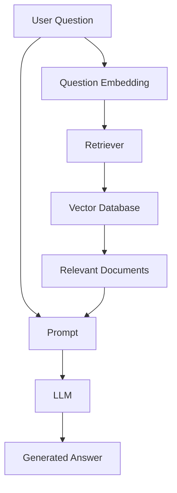

แนวคิดสำคัญคือ

```text
Question
   ↓
Retrieve Knowledge
   ↓
Build Context
   ↓
LLM
   ↓
Answer
```

---

# 11. LLM + AI Agent

LLM สามารถเป็น **Reasoning Engine** ของ AI Agent

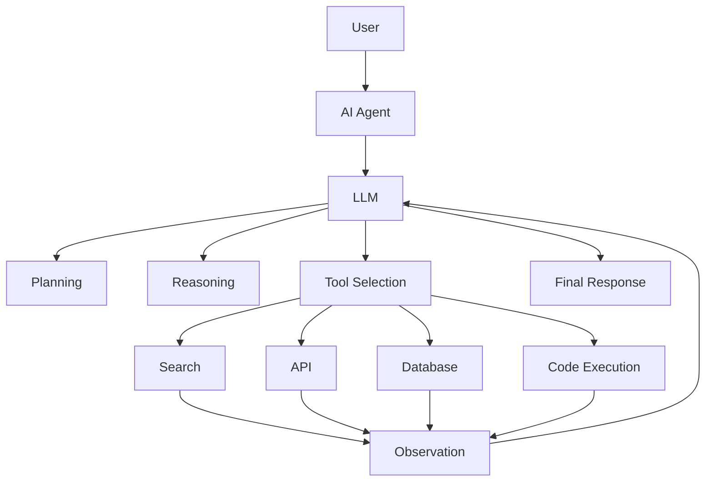

---

# 12. LLM Model ในระบบ AI สมัยใหม่

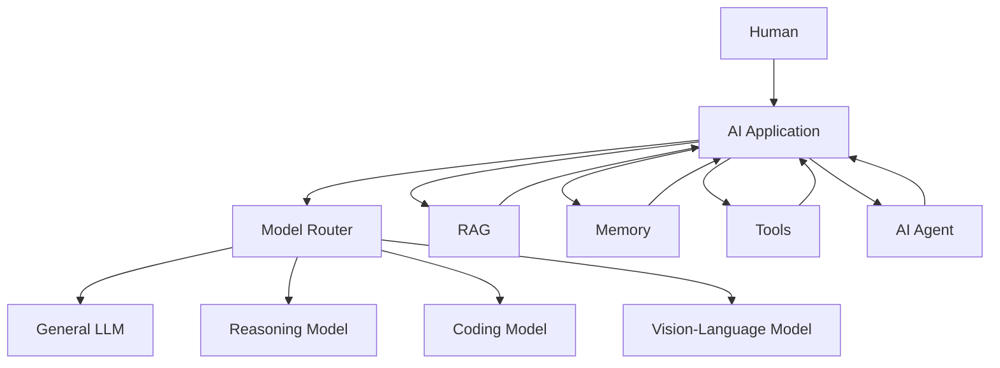

---

# 13. LLM Model Stack

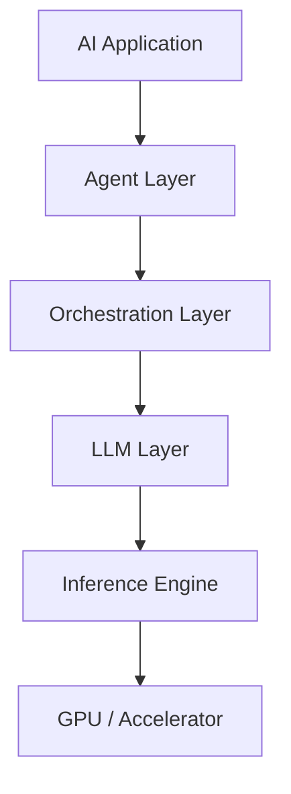

ตัวอย่าง Stack

```text
Application
     ↓
AI Agent
     ↓
RAG / Memory / Tools
     ↓
LLM
     ↓
Inference Engine
     ↓
GPU
```

---

# 14. LLM Model กับ Software Engineering

LLM สามารถเข้ามาช่วยในหลายขั้นตอนของ Software Engineering

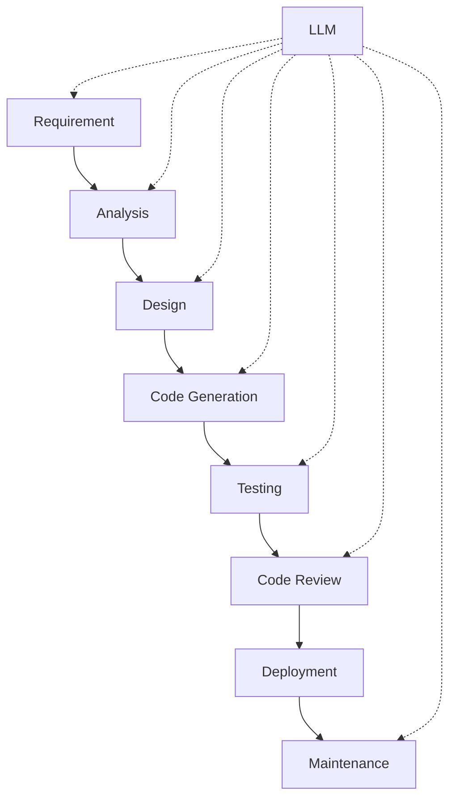

---

# 15. สรุป LLM Model

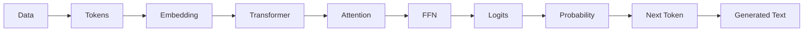

**สรุปสั้น ๆ**

> **LLM = Tokenization + Embedding + Transformer + Attention + Feed Forward + Training + Inference + Decoding**

และเมื่อ LLM ถูกนำมารวมกับ

```text
LLM
 +
RAG
 +
Memory
 +
Tools
 +
Planning
 +
Reasoning
 +
Workflow
```

จะกลายเป็นพื้นฐานสำคัญของ **AI Agent / Agentic AI System** ในยุคปัจจุบัน
