# Question Memory Model

**Question Memory Model** คือแบบจำลองสำหรับจัดเก็บ วิเคราะห์ เชื่อมโยง และเรียกคืน **คำถาม + Intent + Context + Entity + Constraint + ผลลัพธ์จากคำถามก่อนหน้า** เพื่อให้ AI Agent สามารถเข้าใจคำถามใหม่โดยอาศัยประวัติการสนทนาได้อย่างถูกต้อง

แนวคิดหลัก:
### Flow of Question 
---
> **
> **Question → Analyze → Store → Retrieve → Relate → Update → Reuse**
> **
---

## 1. Question Memory Model Architecture

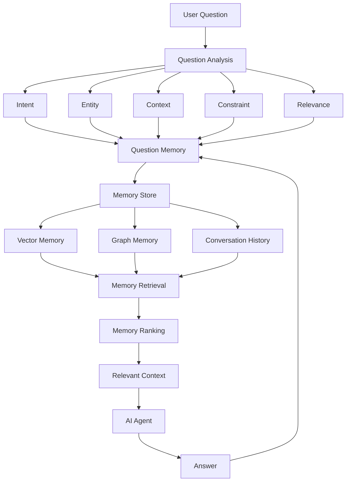

---

# 2. โครงสร้าง Question Memory

สามารถออกแบบ Memory 1 รายการเป็น:

```text
Question Memory
│
├── Question
│
├── Intent
│
├── Entity
│
├── Context
│
├── Constraint
│
├── Topic
│
├── Related Questions
│
├── Answer
│
├── Feedback
│
├── Relevance Score
│
└── Timestamp
```

---

# 3. Question Memory Schema

ตัวอย่าง JSON:

```json
{
  "memory_id": "qm_001",
  "question": "GraphRAG คืออะไร?",

  "intent": {
    "type": "explain",
    "confidence": 0.96
  },

  "entities": [
    "GraphRAG"
  ],

  "context": [
    "RAG",
    "Knowledge Graph",
    "AI"
  ],

  "constraints": {
    "language": "Thai",
    "level": "beginner",
    "format": "Markdown"
  },

  "topic": [
    "AI",
    "RAG",
    "GraphRAG"
  ],

  "related_questions": [
    "qm_0001",
    "qm_0005"
  ],

  "relevance_score": 0.94,

  "timestamp": "2026-08-27T08:00:00"
}
```

---

# 4. Memory Types

Question Memory สามารถแบ่งเป็น 4 ประเภทหลัก

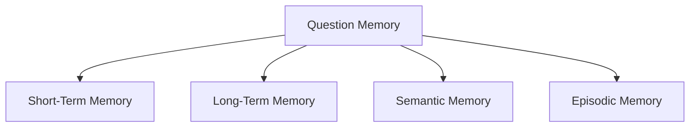

### Short-Term Memory

จำคำถามใน Conversation ปัจจุบัน

```text
Q1 → Q2 → Q3 → Q4
```

### Long-Term Memory

จำข้อมูลที่สำคัญข้าม Session

```text
Session 1
Session 2
Session 3
```

### Semantic Memory

จำความสัมพันธ์เชิงความหมาย

```text
RAG
 ↓
GraphRAG
 ↓
Knowledge Graph
```

### Episodic Memory

จำเหตุการณ์หรือประสบการณ์จากการสนทนา

```text
ผู้ใช้ถามเรื่อง RAG
→ ขอ Python Example
→ ขอ GraphRAG
→ ขอ Architecture
```

---

# 5. Question Memory แบบ Vector

แต่ละคำถามสามารถแปลงเป็น Embedding:

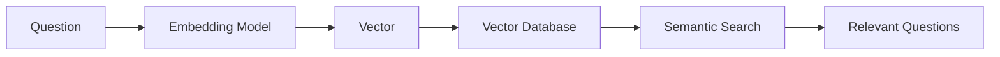

ตัวอย่าง:

```text
Question 1:
"RAG คืออะไร?"

Question 2:
"Retrieval Augmented Generation ทำงานอย่างไร?"

Question 3:
"Python คืออะไร?"
```

เมื่อถาม:

```text
"ช่วยอธิบาย Retrieval Augmented Generation"
```

ระบบสามารถค้นพบว่า:

```text
Q1 → High Similarity
Q2 → Very High Similarity
Q3 → Low Similarity
```

---

# 6. Question Memory แบบ Graph

อีกแนวทางคือสร้าง **Question Knowledge Graph**

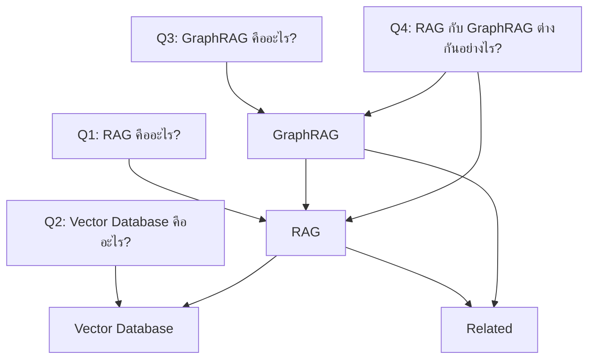

ข้อดีคือ Agent สามารถเข้าใจ:

```text
Question
 ↓
Topic
 ↓
Related Topic
 ↓
Previous Question
```

---

# 7. Question Relationship

Memory แต่ละรายการสามารถเชื่อมกันด้วย Relationship:

```text
PREVIOUS
FOLLOW_UP
RELATED
CLARIFICATION
CORRECTION
EXPANSION
COMPARISON
```

ตัวอย่าง:

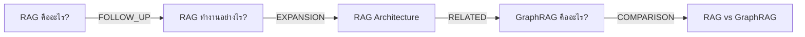

นี่ทำให้ Question Memory กลายเป็น **Question Graph** แทนที่จะเป็นเพียงรายการคำถาม

---

# 8. Question Memory Retrieval

เมื่อมีคำถามใหม่:

```text
Current Question
       ↓
Question Analysis
       ↓
Embedding
       ↓
Vector Search
       ↓
Graph Search
       ↓
Keyword Search
       ↓
Merge
       ↓
Ranking
       ↓
Relevant Memory
```

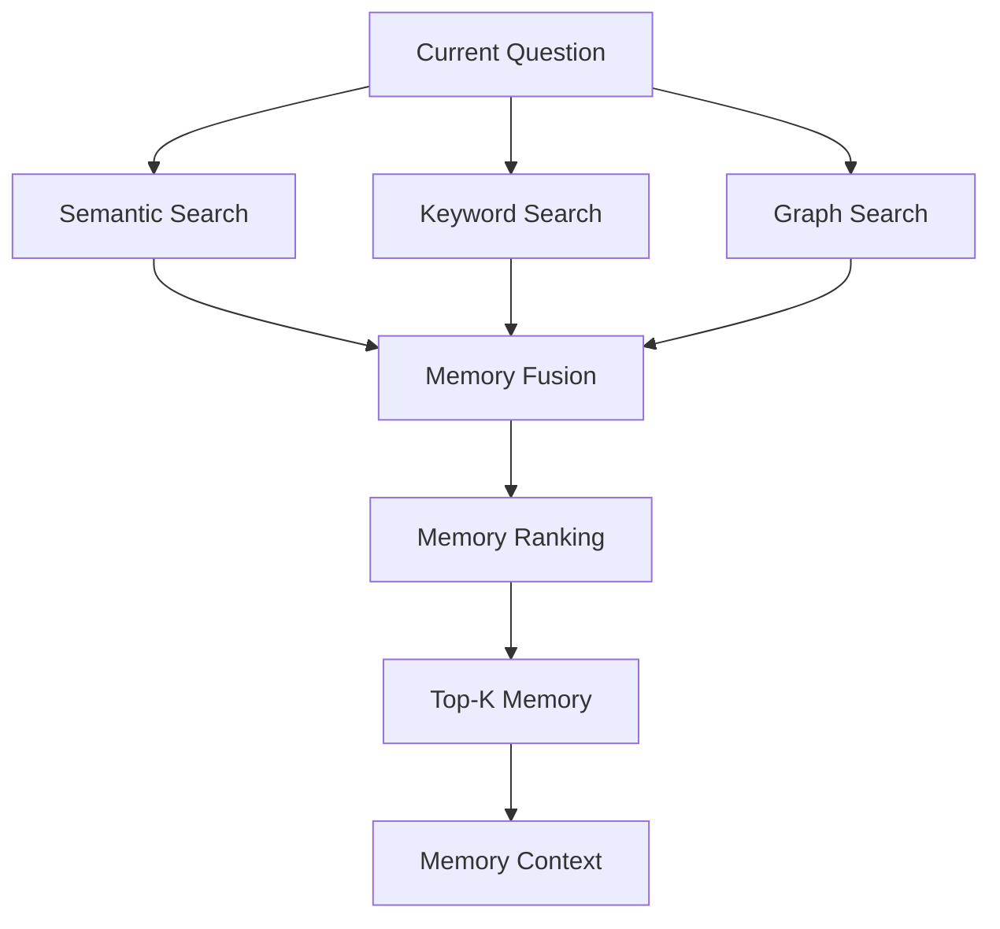

---

# 9. Memory Ranking

ไม่ควรเลือก Memory จาก Similarity เพียงอย่างเดียว

สามารถคำนวณ:

```text
Memory Score
=
Semantic Similarity
+
Recency
+
Topic Relevance
+
Intent Relevance
+
Relationship Strength
```

ตัวอย่าง:

```json
{
  "memory_id": "qm_003",
  "semantic_score": 0.94,
  "recency_score": 0.82,
  "topic_score": 0.96,
  "intent_score": 0.91,
  "relationship_score": 0.88,
  "final_score": 0.92
}
```

---

# 10. Question Memory + Clean Question

Pipeline ที่แนะนำ:

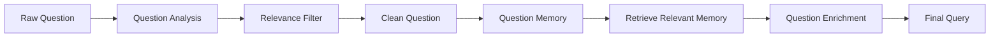

ตัวอย่าง:

```text
Previous:
"ผมกำลังสร้างระบบ RAG ด้วย Python"

Current:
"แล้วถ้าเพิ่ม GraphRAG ล่ะ?"
```

Memory Enrichment:

```text
"ผมกำลังสร้างระบบ RAG ด้วย Python
แล้วถ้าเพิ่ม GraphRAG เข้าไปในระบบล่ะ?"
```

---

# 11. Question Memory กับ Context Engineering

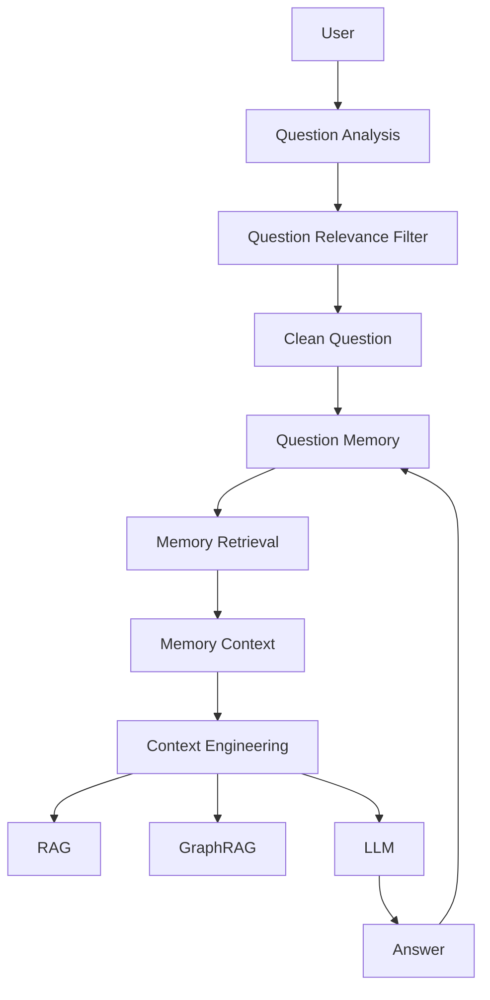

ดังนั้น Question Memory เป็นหนึ่งใน **แหล่ง Context** ของ Context Engineering

```text
Context
│
├── Current Question
├── Question Memory
├── Conversation Memory
├── User Context
├── External Knowledge
├── RAG
└── GraphRAG
```

---

# 12. Python Question Memory Model

```python
from dataclasses import dataclass, field
from datetime import datetime


@dataclass
class QuestionMemory:
    memory_id: str
    question: str

    intent: str

    entities: list[str] = field(default_factory=list)
    context: list[str] = field(default_factory=list)
    constraints: dict = field(default_factory=dict)

    topic: list[str] = field(default_factory=list)
    related_questions: list[str] = field(default_factory=list)

    relevance_score: float = 0.0

    timestamp: str = field(
        default_factory=lambda: datetime.now().isoformat()
    )


memory = QuestionMemory(
    memory_id="qm_001",
    question="GraphRAG คืออะไร?",
    intent="explain",
    entities=["GraphRAG"],
    context=["RAG", "Knowledge Graph"],
    constraints={
        "language": "Thai",
        "level": "beginner"
    },
    topic=["AI", "RAG"],
    relevance_score=0.95
)

print(memory)
```

---

# 13. Memory Store

```python
class QuestionMemoryStore:

    def __init__(self):
        self.memories = {}

    def save(self, memory):
        self.memories[memory.memory_id] = memory

    def get(self, memory_id):
        return self.memories.get(memory_id)

    def all(self):
        return list(self.memories.values())


store = QuestionMemoryStore()

store.save(memory)

print(store.get("qm_001"))
```

สำหรับ Production สามารถเปลี่ยนจาก Python Dictionary เป็น:

```text
PostgreSQL
PostgreSQL + pgvector
Qdrant
Milvus
Weaviate
Neo4j
```

---

# 14. Hybrid Question Memory

Architecture ที่น่าสนใจที่สุดคือ **Hybrid Memory**

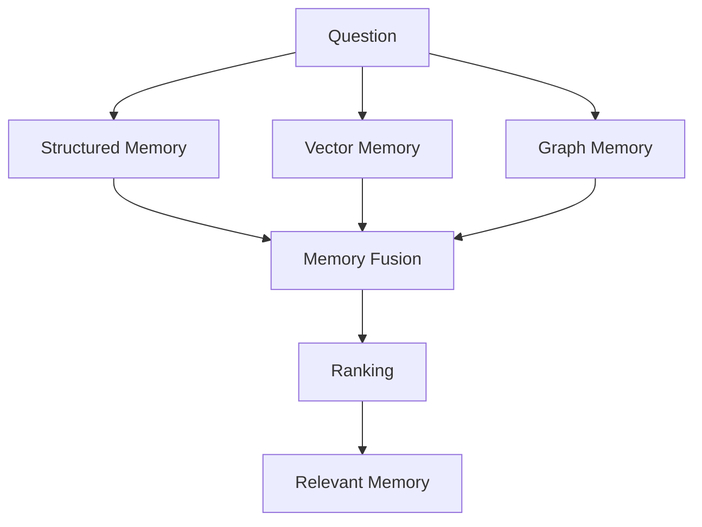

### Structured Memory

เก็บ:

```text
Intent
Entity
Constraint
Timestamp
```

### Vector Memory

เก็บ:

```text
Semantic Meaning
```

### Graph Memory

เก็บ:

```text
Relationship
```

---

# 15. Recommended Database Architecture

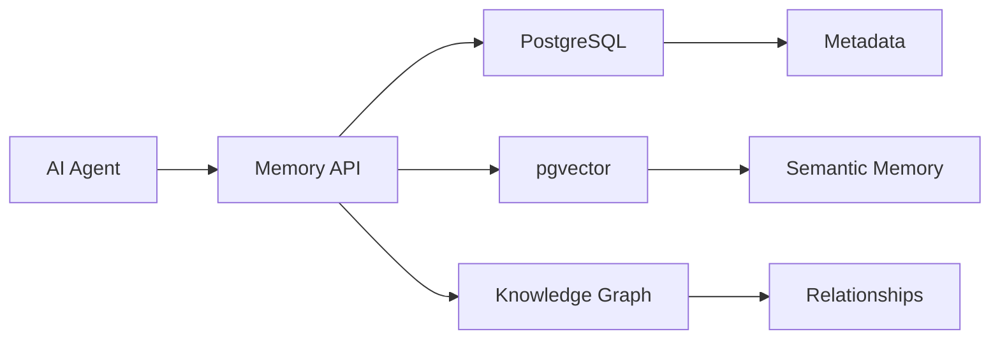

สำหรับ Prototype สามารถเริ่มง่าย ๆ:

```text
PostgreSQL
+
pgvector
```

แล้วค่อยเพิ่ม:

```text
PostgreSQL
+
pgvector
+
Neo4j
```

เมื่อระบบต้องการ Relationship/Graph reasoning มากขึ้น

---

# 16. Complete Question Memory Model

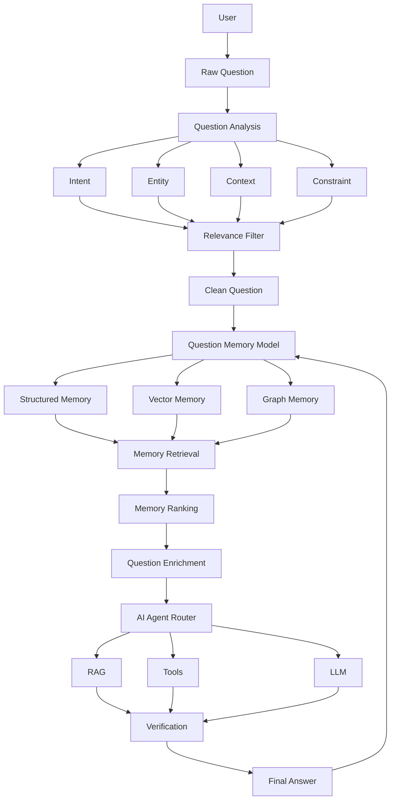

---

# 17. แนวคิดสำหรับ MAMO

หากกำลังออกแบบ **MAMO Context Engineering** ผมแนะนำให้กำหนด `Question Memory Model` เป็นหนึ่งใน Core Memory Layer:

```text
MAMO Context Engineering
│
├── Question Analysis
│
├── Question Relevance Filter
│
├── Clean Question
│
├── Question Memory Model
│   │
│   ├── Short-Term Memory
│   ├── Long-Term Memory
│   ├── Semantic Memory
│   ├── Episodic Memory
│   ├── Vector Memory
│   └── Graph Memory
│
├── Context Retrieval
│
├── Context Ranking
│
├── Context Compression
│
└── Context Assembly
```

### สรุปเป็นสูตร

```text
Question Memory
=
Question
+
Intent
+
Entity
+
Context
+
Constraint
+
Relationship
+
History
+
Semantic Representation
+
Relevance
```

และวงจรการทำงานคือ:

```text
          ┌──────────────┐
          │   Question   │
          └──────┬───────┘
                 ↓
            Analyze
                 ↓
             Store
                 ↓
             Retrieve
                 ↓
              Rank
                 ↓
               Use
                 ↓
              Update
                 │
                 └──────────→ Memory
```

**หัวใจของ Question Memory Model คือ “จำอย่างมีโครงสร้าง ไม่ใช่จำทุกอย่าง”** เพราะ Memory ที่ดีต้องสามารถตอบได้ว่า **อะไรควรจำ, ทำไมต้องจำ, เกี่ยวข้องกับคำถามปัจจุบันแค่ไหน และควรนำกลับมาใช้เมื่อใด**.
