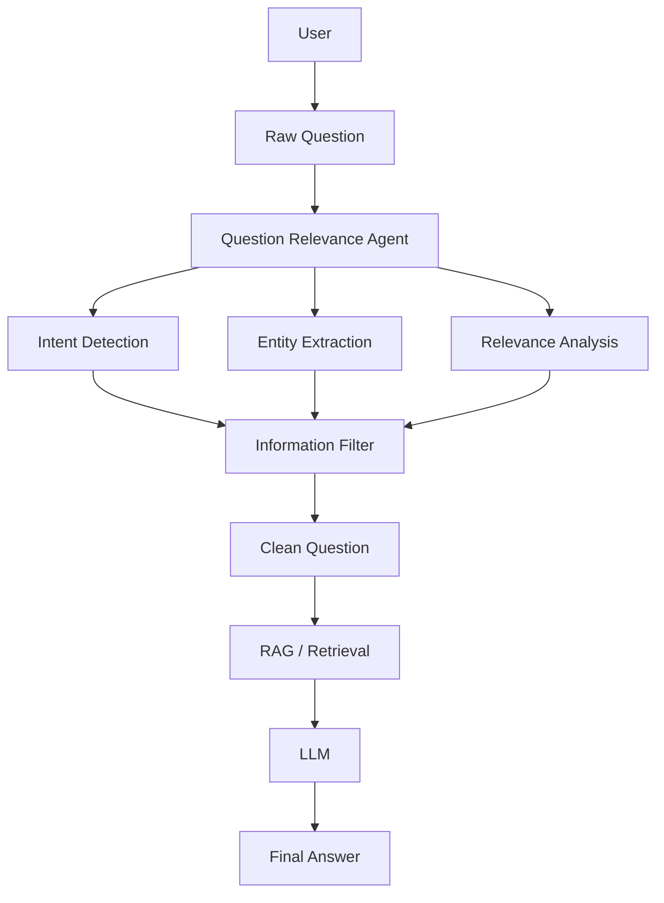
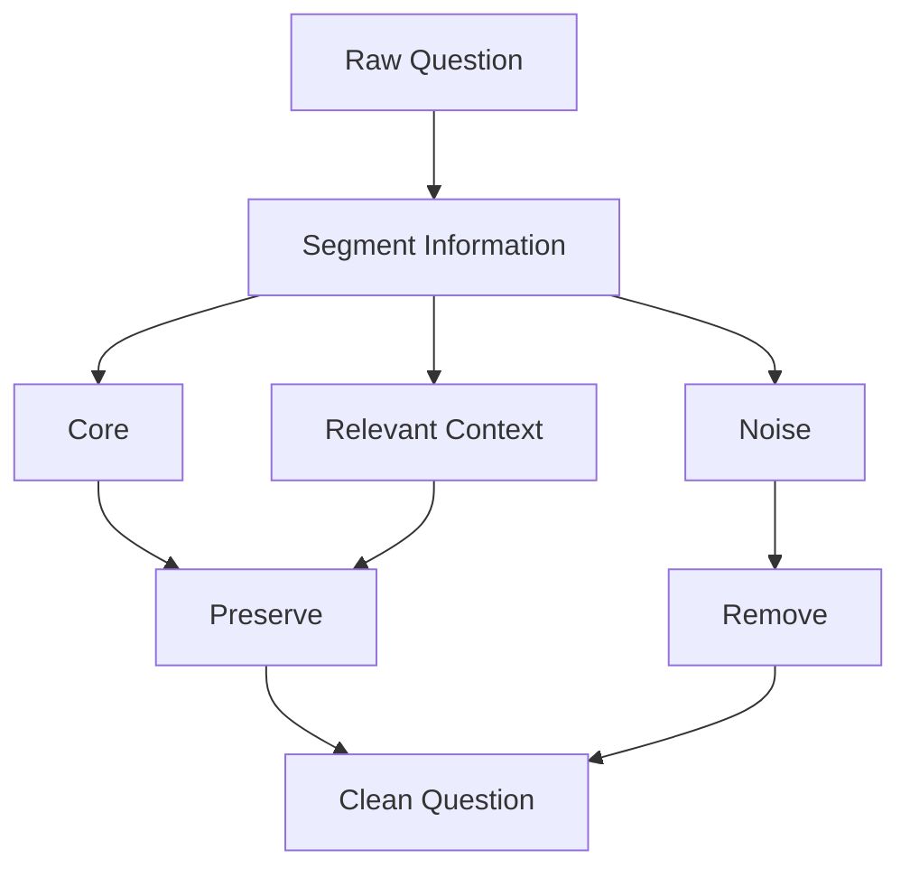
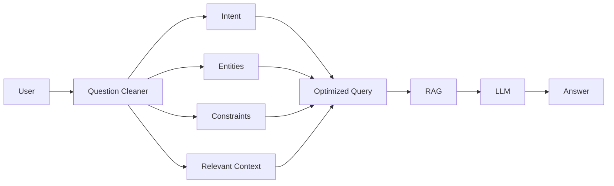
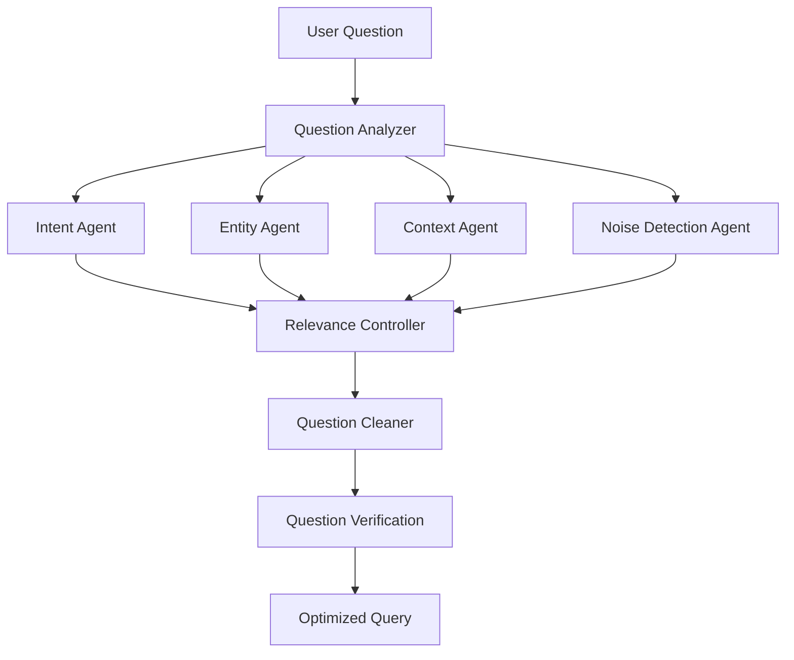
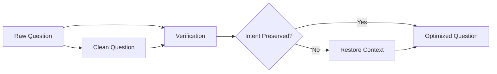
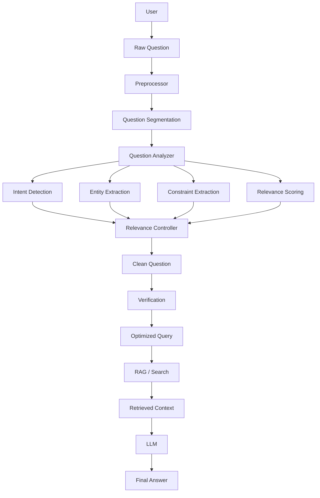
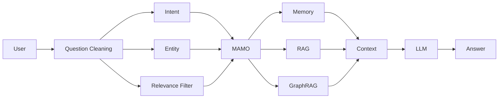

# AI Agent: Question Relevance Filter

## 1. แนวคิด

ระบบ **Question Relevance Filter Agent** ทำหน้าที่วิเคราะห์คำถามของผู้ใช้
แล้วตัดข้อมูลที่ไม่เกี่ยวข้องกับเป้าหมายของคำถามออก

---

**Question Relevance Filter** คือกลไกหรือ AI Agent ที่ทำหน้าที่ ตรวจสอบและคัดกรองข้อมูลในคำถามของผู้ใช้ว่า “ส่วนไหนเกี่ยวข้องกับสิ่งที่ต้องการถาม” และ “ส่วนไหนไม่เกี่ยวข้อง” ก่อนส่งคำถามไปยัง LLM, RAG หรือ AI Agent ตัวอื่น

---

**Clean Question** คือ คำถามที่ผ่านการทำความสะอาดและคัดกรองข้อมูลแล้ว โดยตัดข้อมูลที่ไม่เกี่ยวข้อง (Noise) ออก แต่ยังคง Intent, Entity, Context และ Constraint ที่จำเป็น เพื่อให้ LLM, RAG หรือ AI Agent เข้าใจคำถามได้แม่นยำขึ้น

---

```text
Raw Question
     ↓
Question Analysis
     ↓
Intent Detection
     ↓
Relevance Classification
     ↓
Remove Irrelevant Information
     ↓
Clean Question
     ↓
RAG / LLM
````

---

# 2. ตัวอย่าง

### Input

```text
ผมกำลังทำโปรเจกต์ Python ที่มหาวิทยาลัย
เมื่อวานผมอ่านบทความเกี่ยวกับ Database
ตอนนี้ผมอยากรู้ว่า SQL JOIN คืออะไร
และเพื่อนผมบอกว่า JOIN สำคัญมาก
ช่วยอธิบายให้เข้าใจง่ายหน่อย
```

### Agent วิเคราะห์

```text
Relevant
✓ SQL JOIN
✓ ความหมาย
✓ ต้องการคำอธิบายแบบเข้าใจง่าย

Irrelevant
✗ โปรเจกต์ Python
✗ มหาวิทยาลัย
✗ อ่านบทความเมื่อวาน
✗ ความเห็นของเพื่อน
```

### Output

```text
SQL JOIN คืออะไร?
อธิบายให้เข้าใจง่าย พร้อมตัวอย่าง
```

---

# 3. Architecture



---

# 4. Agent Pipeline

```text
Raw Question
     ↓
Normalize
     ↓
Segment
     ↓
Intent Detection
     ↓
Entity Extraction
     ↓
Relevance Scoring
     ↓
Remove Irrelevant Content
     ↓
Preserve Important Context
     ↓
Clean Question
```

---

# 5. Relevance Classification

ให้ Agent จำแนกข้อมูลแต่ละส่วนเป็น:

```text
CORE
CONTEXT
NOISE
```

### CORE

ข้อมูลที่จำเป็นต่อการตอบคำถาม

```text
SQL JOIN
```

### CONTEXT

ข้อมูลที่อาจช่วยให้ตอบได้ดีขึ้น

```text
ต้องการคำอธิบายสำหรับผู้เริ่มต้น
```

### NOISE

ข้อมูลที่ไม่ช่วยตอบคำถาม

```text
เมื่อวานอ่านบทความ
เพื่อนบอกว่า JOIN สำคัญ
กำลังทำโปรเจกต์ Python
```

---

# 6. Relevance Score

กำหนดคะแนนความเกี่ยวข้อง:

```text
0.0 - 0.2 = Noise
0.2 - 0.5 = Low Relevance
0.5 - 0.8 = Relevant Context
0.8 - 1.0 = Core Information
```

ตัวอย่าง:

```json
{
  "segments": [
    {
      "text": "SQL JOIN คืออะไร",
      "score": 0.98,
      "type": "CORE"
    },
    {
      "text": "อธิบายให้เข้าใจง่าย",
      "score": 0.92,
      "type": "CORE"
    },
    {
      "text": "ผมกำลังทำโปรเจกต์ Python",
      "score": 0.18,
      "type": "NOISE"
    }
  ]
}
```

---

# 7. Python Prototype

```python
from dataclasses import dataclass


@dataclass
class Segment:
    text: str
    score: float
    category: str


class QuestionRelevanceAgent:

    def __init__(self, threshold=0.50):
        self.threshold = threshold

    def filter(self, segments):
        relevant = []

        for segment in segments:
            if segment.score >= self.threshold:
                relevant.append(segment.text)

        return " ".join(relevant)


segments = [
    Segment(
        "ผมกำลังทำโปรเจกต์ Python",
        0.18,
        "NOISE"
    ),
    Segment(
        "SQL JOIN คืออะไร",
        0.98,
        "CORE"
    ),
    Segment(
        "อธิบายให้เข้าใจง่าย",
        0.92,
        "CORE"
    )
]

agent = QuestionRelevanceAgent()

clean_question = agent.filter(segments)

print(clean_question)
```

ผลลัพธ์:

```text
SQL JOIN คืออะไร อธิบายให้เข้าใจง่าย
```

---

# 8. LLM-based Relevance Agent

ในระบบจริงไม่ควรกำหนด Score แบบ Hard-code
แต่ให้ LLM วิเคราะห์แต่ละ Segment

```python
SYSTEM_PROMPT = """
You are a Question Relevance Agent.

Your task is to analyze a user's question.

Classify each information segment as:

CORE:
Required to answer the question.

CONTEXT:
Useful context that may improve the answer.

NOISE:
Information unrelated to the user's actual intent.

Rules:
1. Preserve the user's intent.
2. Preserve important constraints.
3. Preserve entities, numbers, dates and technical terms.
4. Remove unnecessary personal stories.
5. Do not change the meaning.
6. Do not invent information.
7. Return a concise cleaned question.
"""
```

---

# 9. Structured Output

ให้ Agent ส่งผลลัพธ์เป็น JSON:

```json
{
  "intent": "explain SQL JOIN",
  "core": [
    "SQL JOIN"
  ],
  "context": [
    "ผู้เริ่มต้น"
  ],
  "noise": [
    "กำลังทำโปรเจกต์ Python",
    "อ่านบทความเมื่อวาน",
    "เพื่อนบอกว่า JOIN สำคัญ"
  ],
  "clean_question": "SQL JOIN คืออะไร? อธิบายสำหรับผู้เริ่มต้นพร้อมตัวอย่าง"
}
```

---

# 10. Important: อย่าตัด Context มากเกินไป

จุดนี้สำคัญมาก

AI Agent ไม่ควรใช้หลักว่า:

```text
สั้นที่สุด = ดีที่สุด
```

แต่ควรใช้:

```text
Relevant Information
        +
Necessary Context
        -
Irrelevant Noise
```

เพราะข้อมูลบางอย่างดูเหมือนไม่เกี่ยวข้อง
แต่จริง ๆ แล้วอาจมีผลต่อคำตอบ

ตัวอย่าง:

```text
"ผมต้องการเขียน SQL JOIN สำหรับ MySQL 8.0"
```

คำว่า:

```text
MySQL 8.0
```

ต้องเก็บไว้ เพราะมีผลต่อคำตอบ

---

# 11. Context Preservation



---

# 12. Context Engineering Architecture

Agent ตัวนี้สามารถเป็นขั้นตอนแรกของ Context Engineering



---

# 13. Query Optimization

ตัวอย่าง:

```text
Raw Query
↓
"คือผมกำลังเรียน Database อยู่ แล้วเมื่อวานอาจารย์พูดถึง
Normalization และผมก็เคยเรียน SQL มาบ้าง แต่ยังไม่ค่อยเข้าใจ
ว่า 1NF 2NF 3NF ต่างกันอย่างไร ช่วยอธิบายหน่อยครับ"
```

Agent:

```text
Intent:
เปรียบเทียบ 1NF, 2NF และ 3NF

Relevant Context:
ผู้เรียนมีพื้นฐาน SQL

Noise:
"เมื่อวานอาจารย์พูด"
```

Optimized Query:

```text
อธิบายความแตกต่างระหว่าง 1NF, 2NF และ 3NF
สำหรับผู้ที่มีพื้นฐาน SQL พร้อมตัวอย่าง
```

---

# 14. Agent State

สามารถเก็บ State ระหว่างการประมวลผล:

```json
{
  "raw_question": "...",
  "intent": "...",
  "entities": [],
  "constraints": [],
  "context": [],
  "noise": [],
  "clean_question": "...",
  "confidence": 0.94
}
```

---

# 15. Multi-Agent Version

สามารถแยกเป็นหลาย Agent:



---

# 16. Verification

ควรมี Agent ตรวจสอบหลัง Clean

```text
Original Question
       ↓
Clean Question
       ↓
Compare
       ↓
Intent Preserved?
       ↓
Yes → Continue
No  → Restore Context
```



---

# 17. Final Agent Architecture



---

# 18. MAMO Context Engineering

ถ้าเอา Agent นี้ไปอยู่ใน **MAMO Context Engineering** จะได้ Pipeline:

```text
User
 ↓
Question Cleaner
 ↓
Intent Detection
 ↓
Entity Extraction
 ↓
Relevance Filtering
 ↓
Context Selection
 ↓
Query Optimization
 ↓
Memory Retrieval
 ↓
RAG
 ↓
GraphRAG
 ↓
Context Ranking
 ↓
Context Compression
 ↓
LLM
 ↓
Answer
```

หรือ:



---

# 19. แนวคิดสำคัญ

Agent นี้ไม่ควรมีหน้าที่เพียง **"ตัดคำ"**

แต่ควรทำหน้าที่:

```text
Question Understanding
        ↓
Intent Understanding
        ↓
Relevance Detection
        ↓
Context Preservation
        ↓
Noise Removal
        ↓
Query Optimization
```

ดังนั้นชื่อ Component ที่เหมาะสมอาจเป็น:

```text
Question Relevance Agent
Query Cleaning Agent
Query Optimization Agent
Context Filtering Agent
Intent-Preserving Query Agent
```

สำหรับ MAMO ผมแนะนำชื่อ:

```text
MAMO Query Relevance Agent
```

และให้เป็น **Gatekeeper Layer** ก่อนเข้าสู่ Memory, RAG, GraphRAG และ LLM เพื่อช่วยลด **irrelevant context, retrieval noise และ context overload** โดยต้องมีขั้นตอน **verification** เพื่อป้องกันการตัดข้อมูลสำคัญออกไป

```
```
