# MAMO Context Engineering Project

> **MAMO Context Engineering** คือ Framework สำหรับจัดการ Context ของ LLM และ AI Agent ตั้งแต่การรวบรวมข้อมูล การค้นหา การจัดลำดับ การกรอง การบีบอัด การส่ง Context เข้า Model ไปจนถึงการประเมินผลและอัปเดต Memory

---
# 🧠 MAMO Context Engineering

> **Memory • Awareness • Model Context • Orchestration**


## 🛠️ Software Tools

### 💻 Development


### 🤖 AI & Agent


### 📚 RAG & Knowledge


### 🗄️ Database & Memory


### 📊 Evaluation & Monitoring


## 🛠️ Software Tools

MAMO Context Engineering สามารถพัฒนาด้วย Software Tools ที่ครอบคลุมตั้งแต่
LLM, AI Agent, RAG, Memory, Vector Database, Knowledge Graph ไปจนถึง
Evaluation และ Monitoring

### 🧩 Technology Stack

| Layer | Software Tools | Purpose |
|---|---|---|
| 🧠 LLM | OpenAI, Claude, Gemini, Qwen | Reasoning และ Text Generation |
| 🤖 AI Agent | LangGraph, LangChain, CrewAI | Agent Workflow และ Orchestration |
| 📚 RAG | LlamaIndex, LangChain | Retrieval-Augmented Generation |
| 🔢 Embedding | Sentence Transformers, BGE, Qwen Embedding | สร้าง Vector Representation |
| 🎯 Reranker | BGE Reranker, Qwen Reranker | จัดอันดับ Context |
| 🗄️ Vector DB | Qdrant, Milvus, Weaviate, pgvector | Vector Search |
| 🕸️ Knowledge Graph | Neo4j | จัดการความสัมพันธ์ของข้อมูล |
| 🧠 Memory | Redis, PostgreSQL, Vector DB | Short-Term / Long-Term Memory |
| ⚡ Backend | Python, FastAPI | API และ Backend Services |
| 🎨 Frontend | Next.js, React | Web Application |
| 🔄 Workflow | n8n | Automation และ Workflow |
| 📊 Evaluation | Ragas, DeepEval | RAG และ Agent Evaluation |
| 🔍 Monitoring | Langfuse, LangSmith | Tracing, Debugging และ Monitoring |
| 📦 Container | Docker | Environment และ Deployment |
| 🗃️ Database | PostgreSQL | Application Data และ Metadata |
| 💻 Development | VS Code, Git, GitHub | Development และ Version Control |

---

# 2. ปัญหาที่ MAMO ต้องการแก้

LLM ไม่ควรได้รับข้อมูลทั้งหมดที่ระบบมี

ตัวอย่าง:

```text
100,000 Tokens
      ↓
ข้อมูลทั้งหมด
      ↓
LLM
```

อาจทำให้เกิดปัญหา:

* Context ยาวเกินไป
* Token Cost สูง
* Latency สูง
* ข้อมูลไม่เกี่ยวข้อง
* ข้อมูลเก่า
* ข้อมูลซ้ำ
* Context Conflict
* Model สับสน
* ความแม่นยำลดลง

MAMO จึงเปลี่ยนกระบวนการเป็น:

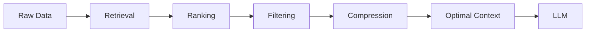

---

# 3. M — Memory

**Memory** คือระบบจัดเก็บข้อมูลที่ Agent สามารถนำกลับมาใช้ในอนาคต

## 3.1 ประเภทของ Memory

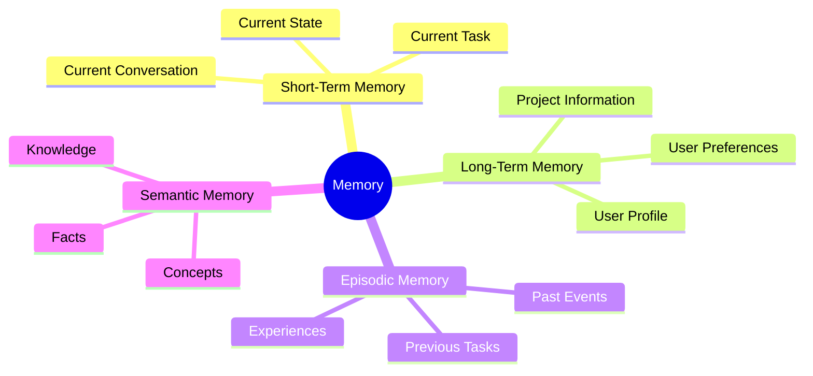

---

## 3.2 Short-Term Memory

เก็บข้อมูลในบทสนทนาปัจจุบัน

```text
User:
ฉันกำลังสร้างระบบ RAG

User:
ช่วยออกแบบ Architecture ให้หน่อย
```

---

## 3.3 Long-Term Memory

เก็บข้อมูลที่สามารถนำกลับมาใช้ในอนาคต

```text
User Preferences

- สนใจ AI Agent
- สนใจ RAG
- ใช้ Python
- ต้องการคำอธิบายภาษาไทย
```

---

## 3.4 Episodic Memory

เก็บเหตุการณ์หรือประสบการณ์

```text
Project A
    ↓
Problem
    ↓
Solution
    ↓
Result
```

---

## 3.5 Semantic Memory

เก็บข้อเท็จจริงและความรู้

```text
RAG
├── Retrieval
├── Embedding
├── Vector Database
└── Reranking
```

---

# 4. Python: Memory Manager

ตัวอย่าง Memory แบบง่ายด้วย Python

```python
class MemoryManager:

    def __init__(self):
        self.short_term = []
        self.long_term = []

    def add_short_term(self, content):
        self.short_term.append(content)

    def add_long_term(self, content):
        self.long_term.append(content)

    def get_short_term(self):
        return self.short_term

    def get_long_term(self):
        return self.long_term

    def clear_short_term(self):
        self.short_term = []


memory = MemoryManager()

memory.add_short_term(
    "User กำลังพัฒนาระบบ RAG"
)

memory.add_long_term(
    "User สนใจ AI Agent และ Context Engineering"
)

print(memory.get_short_term())
print(memory.get_long_term())
```

---

# 5. A — Awareness

**Awareness** คือความสามารถของ Agent ในการเข้าใจ Context ปัจจุบัน

Agent ควรรู้:

```text
Who?
What?
When?
Where?
Why?
Goal?
Current State?
Constraints?
```

### Awareness Architecture

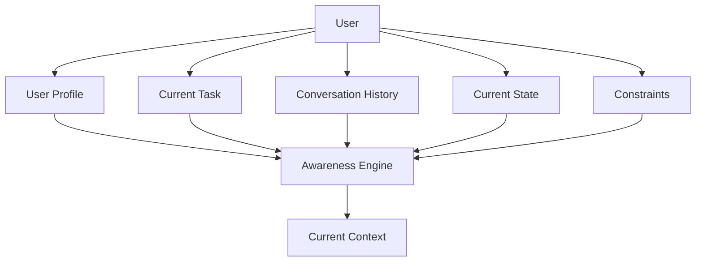

---

# 6. Python: Awareness Engine

```python
class AwarenessEngine:

    def build_context(
        self,
        user,
        task,
        history,
        state,
        constraints
    ):
        return {
            "user": user,
            "task": task,
            "history": history,
            "state": state,
            "constraints": constraints
        }


awareness = AwarenessEngine()

context = awareness.build_context(
    user="Student",
    task="วิเคราะห์ระบบ RAG",
    history=["สร้าง RAG Architecture"],
    state="กำลังออกแบบระบบ",
    constraints=["ต้องใช้ Python"]
)

print(context)
```

---

# 7. M — Model Context

**Model Context** คือการเลือกข้อมูลที่เหมาะสมสำหรับส่งเข้า LLM

หลักการสำคัญ:

```text
Relevant
+
Recent
+
Reliable
+
Important
+
Task-specific
```

### Context Sources

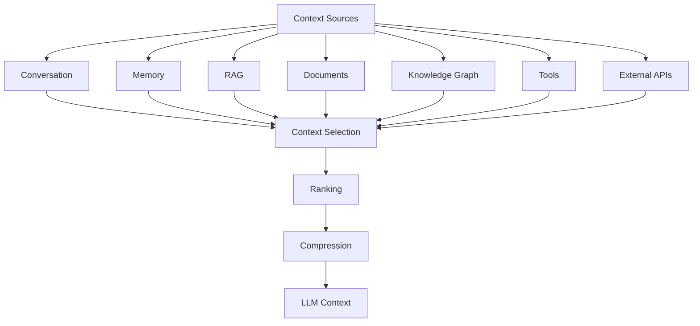

---

# 8. Context Retrieval

สมมติระบบมีข้อมูล 100 รายการ

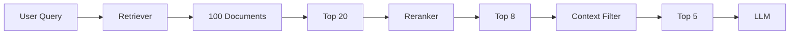

---

# 9. Python: Context Retriever

ตัวอย่างง่ายด้วย Keyword Matching

```python
documents = [
    "RAG ใช้ Retrieval เพื่อค้นหาข้อมูล",
    "Vector Database ใช้เก็บ Embedding",
    "Context Engineering จัดการ Context ของ LLM",
    "Python ใช้พัฒนา AI Agent",
    "Knowledge Graph ใช้แทนความสัมพันธ์ของข้อมูล"
]


def retrieve(query, documents, top_k=3):

    query_words = set(query.lower().split())

    scored = []

    for document in documents:

        words = set(document.lower().split())

        score = len(query_words & words)

        scored.append({
            "document": document,
            "score": score
        })

    scored.sort(
        key=lambda x: x["score"],
        reverse=True
    )

    return scored[:top_k]


results = retrieve(
    "Context LLM",
    documents
)

for result in results:
    print(result)
```

> ในระบบ Production สามารถเปลี่ยนเป็น Vector Search, BM25, Hybrid Search หรือ Reranker ได้

---

# 10. Context Ranking

Context แต่ละรายการควรได้รับคะแนน

สูตรตัวอย่าง:

```text
Context Score =
    Relevance
    +
    Recency
    +
    Importance
    +
    Reliability
```

สามารถกำหนด Weight:

```text
Score =
0.40(Relevance)
+
0.20(Recency)
+
0.20(Importance)
+
0.20(Reliability)
```

---

# 11. Python: Context Ranker

```python
def context_score(
    relevance,
    recency,
    importance,
    reliability
):
    return (
        0.40 * relevance +
        0.20 * recency +
        0.20 * importance +
        0.20 * reliability
    )


contexts = [
    {
        "name": "Document A",
        "relevance": 0.95,
        "recency": 0.90,
        "importance": 0.90,
        "reliability": 0.95
    },
    {
        "name": "Document B",
        "relevance": 0.80,
        "recency": 0.95,
        "importance": 0.70,
        "reliability": 0.80
    }
]


for item in contexts:

    item["score"] = context_score(
        item["relevance"],
        item["recency"],
        item["importance"],
        item["reliability"]
    )


contexts.sort(
    key=lambda x: x["score"],
    reverse=True
)

for item in contexts:

    print(
        item["name"],
        round(item["score"], 3)
    )
```

---

# 12. Context Compression

Context จำนวนมากไม่ควรถูกส่งเข้า LLM โดยตรง

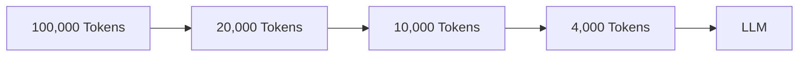

เป้าหมายคือ:

> ลดจำนวน Token แต่ยังคงรักษาข้อมูลที่จำเป็นต่อ Task

---

# 13. Python: Context Compressor

```python
def compress_context(
    contexts,
    max_items=5
):

    selected = contexts[:max_items]

    compressed = "\n".join(
        f"- {item}"
        for item in selected
    )

    return compressed


contexts = [
    "RAG ใช้ Retrieval",
    "Embedding ใช้แทนความหมายของข้อความ",
    "Vector Database ใช้ค้นหา Similarity",
    "Reranker ช่วยจัดอันดับผลลัพธ์",
    "Context Engineering จัดการ Context",
    "LLM ใช้สร้างคำตอบ"
]

compressed = compress_context(
    contexts,
    max_items=4
)

print(compressed)
```

ในระบบจริงสามารถใช้ LLM สำหรับ:

```text
Summarization
+
Deduplication
+
Information Extraction
+
Hierarchical Summarization
```

---

# 14. Context Injection

หลังจากผ่าน Retrieval และ Compression แล้ว ต้องสร้าง Context สำหรับ LLM

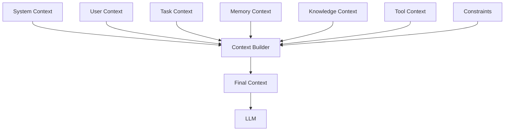

---

# 15. Python: Context Builder

```python
def build_context(
    system,
    user,
    task,
    memory,
    knowledge,
    constraints
):

    return f"""
SYSTEM CONTEXT:
{system}

USER CONTEXT:
{user}

TASK CONTEXT:
{task}

MEMORY CONTEXT:
{memory}

KNOWLEDGE CONTEXT:
{knowledge}

CONSTRAINTS:
{constraints}
"""


context = build_context(
    system="You are an AI Agent.",
    user="นักพัฒนาระบบ AI",
    task="ออกแบบ RAG",
    memory="User สนใจ Context Engineering",
    knowledge="RAG ใช้ Retrieval-Augmented Generation",
    constraints="ตอบเป็นภาษาไทย"
)

print(context)
```

---

# 16. O — Orchestration

**Orchestration** เป็นส่วนควบคุม Workflow ทั้งหมด

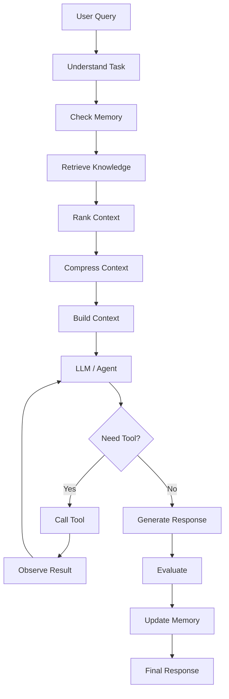

---

# 17. Python: MAMO Orchestrator

```python
class MAMOAgent:

    def __init__(self):

        self.memory = MemoryManager()
        self.awareness = AwarenessEngine()

    def process(self, query):

        # 1. Awareness
        current_context = self.awareness.build_context(
            user="AI Developer",
            task=query,
            history=[],
            state="active",
            constraints=[]
        )

        # 2. Memory
        memories = self.memory.get_long_term()

        # 3. Context Collection
        contexts = [
            query,
            *memories
        ]

        # 4. Context Selection
        selected = contexts[:5]

        # 5. Context Compression
        compressed = compress_context(
            selected
        )

        # 6. Context Injection
        final_context = build_context(
            system="You are an AI Agent.",
            user=current_context["user"],
            task=query,
            memory=str(memories),
            knowledge=compressed,
            constraints="ตอบเป็นภาษาไทย"
        )

        return final_context


agent = MAMOAgent()

agent.memory.add_long_term(
    "User สนใจ RAG และ AI Agent"
)

result = agent.process(
    "ออกแบบระบบ Context Engineering"
)

print(result)
```

---

# 18. MAMO Full Pipeline

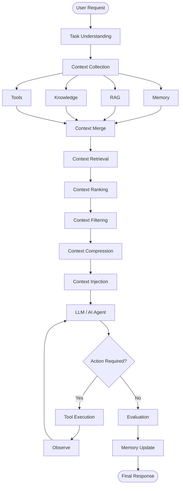

---

# 19. MAMO Context Loop

จุดเด่นของ MAMO คือ Context ไม่ได้จบเมื่อ LLM ตอบคำถาม

ผลลัพธ์สามารถกลับไปสร้าง Memory ใหม่ได้

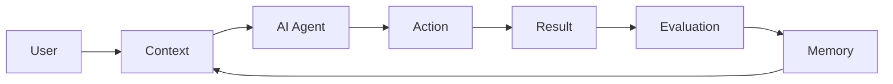

นี่คือ:

> **Context Engineering Feedback Loop**

---

# 20. MAMO + RAG

MAMO สามารถทำงานร่วมกับ RAG ได้

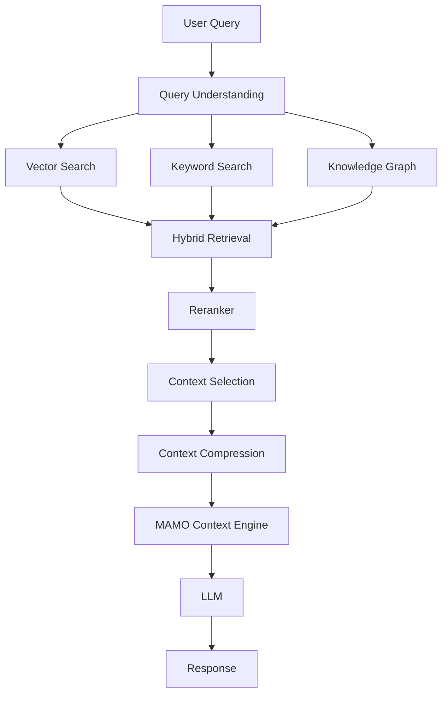

---

# 21. MAMO + AI Agent

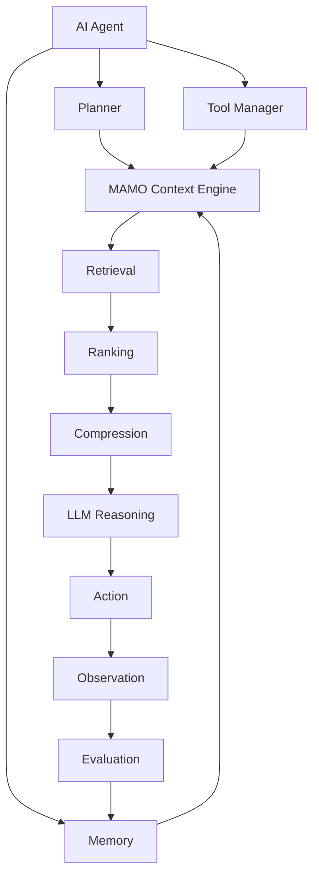

---

# 22. Project Structure

```text
mamo-context-engineering/
│
├── app/
│   ├── main.py
│   ├── agent.py
│   └── orchestrator.py
│
├── context/
│   ├── collector.py
│   ├── selector.py
│   ├── ranker.py
│   ├── compressor.py
│   └── injector.py
│
├── memory/
│   ├── short_term.py
│   ├── long_term.py
│   ├── episodic.py
│   └── semantic.py
│
├── retrieval/
│   ├── vector_search.py
│   ├── keyword_search.py
│   ├── hybrid_search.py
│   └── reranker.py
│
├── knowledge/
│   ├── documents/
│   ├── vector_db.py
│   └── knowledge_graph.py
│
├── agent/
│   ├── planner.py
│   ├── executor.py
│   ├── tool_manager.py
│   └── evaluator.py
│
├── evaluation/
│   ├── relevance.py
│   ├── accuracy.py
│   ├── faithfulness.py
│   ├── latency.py
│   └── cost.py
│
├── tests/
│
├── requirements.txt
│
└── README.md
```

---

# 23. MAMO Core Class

สามารถรวมองค์ประกอบทั้งหมดเป็น Core Engine

```python
class MAMO:

    def __init__(
        self,
        memory,
        retriever,
        ranker,
        compressor,
        llm
    ):
        self.memory = memory
        self.retriever = retriever
        self.ranker = ranker
        self.compressor = compressor
        self.llm = llm

    def run(self, query):

        # 1. Memory
        memories = self.memory.get_long_term()

        # 2. Retrieval
        retrieved = self.retriever(query)

        # 3. Merge Context
        contexts = memories + retrieved

        # 4. Ranking
        ranked = self.ranker(contexts)

        # 5. Compression
        context = self.compressor(ranked)

        # 6. LLM
        response = self.llm(
            query=query,
            context=context
        )

        # 7. Memory Update
        self.memory.add_short_term(
            response
        )

        return response
```

---

# 24. Prompt Engineering vs Context Engineering

| ประเด็น       | Prompt Engineering | Context Engineering |
| ------------- | ------------------ | ------------------- |
| Focus         | Prompt             | Context             |
| Data          | Static             | Dynamic             |
| Memory        | จำกัด              | มีระบบ Memory       |
| RAG           | Optional           | Core Component      |
| Retrieval     | จำกัด              | สำคัญ               |
| Ranking       | ไม่ใช่แกนหลัก      | สำคัญ               |
| Compression   | Optional           | สำคัญ               |
| Tools         | จำกัด              | Integrated          |
| Agent         | ไม่จำเป็น          | รองรับ              |
| Orchestration | ต่ำ                | สูง                 |
| Feedback Loop | จำกัด              | มี                  |
| Complexity    | ต่ำ                | สูง                 |

### สรุป

```text
Prompt Engineering
        ↓
"เขียนคำสั่งอย่างไรให้ AI ตอบดี?"

Context Engineering
        ↓
"AI ควรรู้อะไร?"
        ↓
"ข้อมูลไหนสำคัญ?"
        ↓
"ข้อมูลไหนควรตัด?"
        ↓
"ควรค้นหาอะไร?"
        ↓
"ควรจำอะไร?"
        ↓
"ควรเรียก Tool ไหน?"
        ↓
"ควรส่ง Context อะไรให้ LLM?"
```

---

# 25. MAMO Evaluation Framework

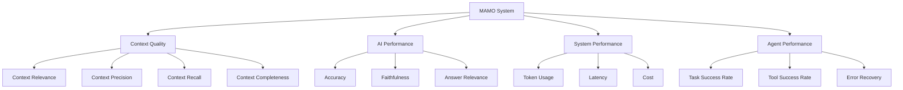

---

# 26. Experimental Design

สำหรับ Research สามารถเปรียบเทียบ:

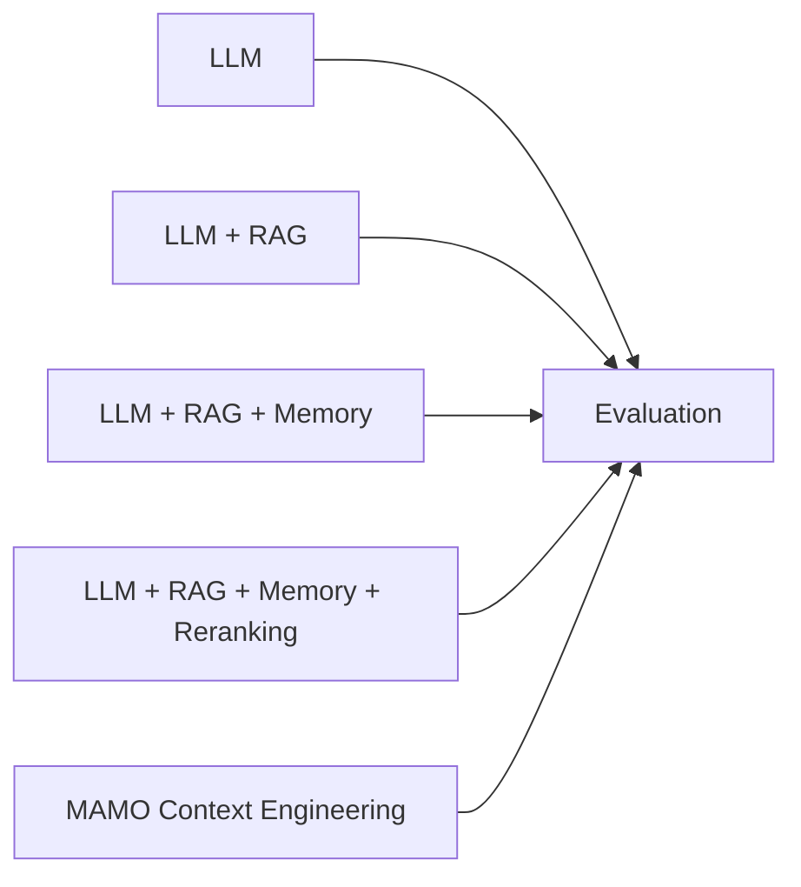

## Metrics

```text
Accuracy
Relevance
Faithfulness
Context Recall
Context Precision
Task Success Rate
Token Usage
Latency
Cost
```

---

# 27. Research Questions

### RQ1

> MAMO Context Engineering สามารถเพิ่ม Context Relevance ของ AI Agent ได้หรือไม่?

### RQ2

> Context Ranking มีผลต่อ Accuracy ของ AI Agent มากน้อยเพียงใด?

### RQ3

> Context Compression สามารถลด Token Usage โดยไม่ลด Task Performance ได้หรือไม่?

### RQ4

> Memory Architecture มีผลต่อ Long-term Task Completion หรือไม่?

### RQ5

> MAMO มีประสิทธิภาพเหนือกว่า RAG Architecture แบบทั่วไปหรือไม่?

---

# 28. MAMO Research Framework

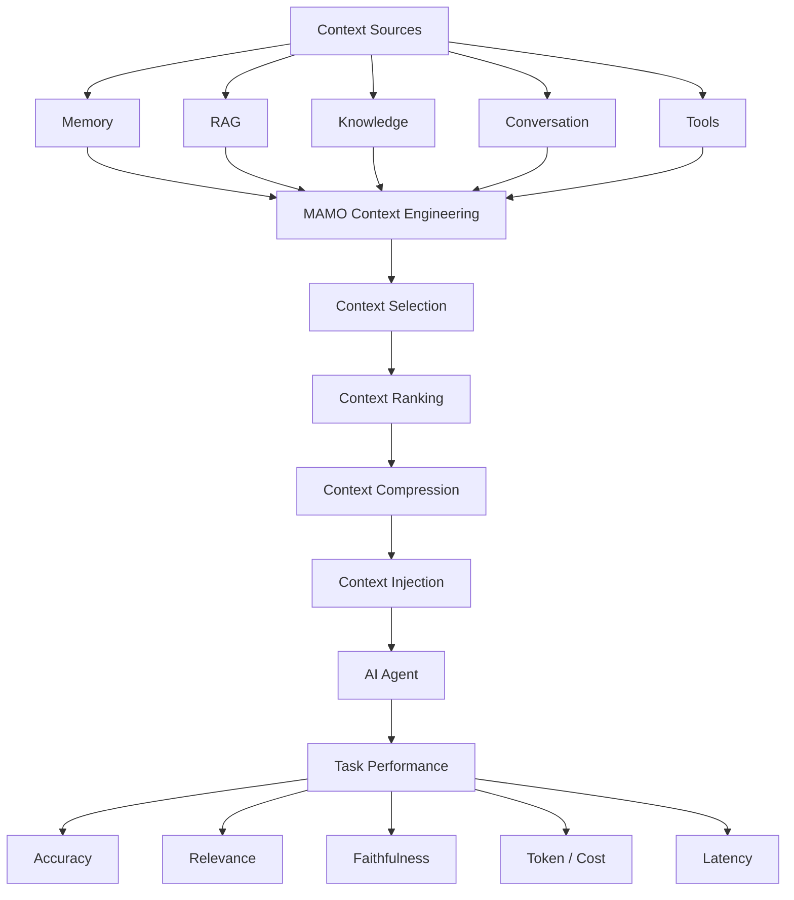

---

# 29. MAMO กับ AI Agent Architecture

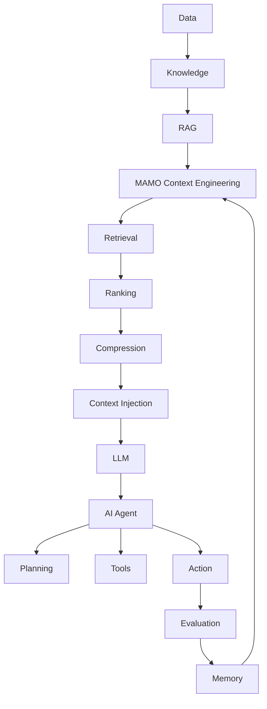

---

# 30. MAMO Context Lifecycle

Context มีวงจรชีวิตตั้งแต่ต้นจนจบ

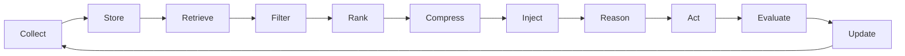

---

# 31. MAMO Implementation Roadmap

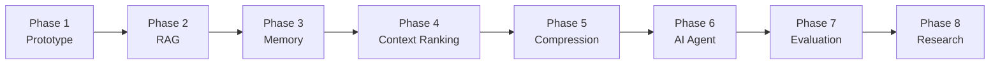

---

# 32. Technology Stack

ตัวอย่าง Technology Stack สำหรับพัฒนา MAMO

```text
Frontend
├── Next.js
├── React
└── Tailwind CSS

Backend
├── Python
├── FastAPI
└── Pydantic

AI
├── LLM
├── Embedding Model
├── Reranker
└── Agent Framework

RAG
├── Vector Search
├── Hybrid Search
└── Knowledge Graph

Memory
├── Short-Term Memory
├── Long-Term Memory
├── Episodic Memory
└── Semantic Memory

Database
├── PostgreSQL
├── Vector Database
└── Redis

Evaluation
├── Accuracy
├── Relevance
├── Faithfulness
├── Latency
├── Token Usage
└── Cost
```

---

# 33. MAMO Final Architecture

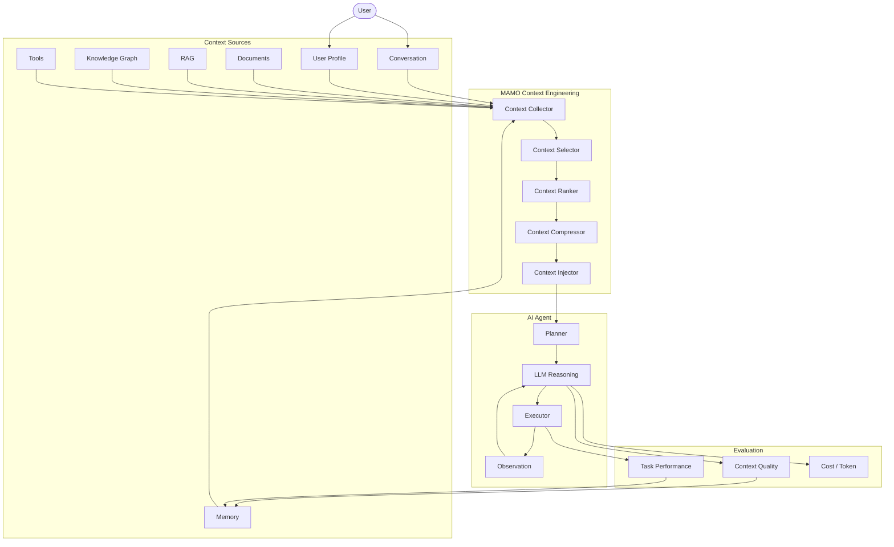

---

# 34. สรุป

MAMO สามารถสรุปเป็น 4 องค์ประกอบหลัก:

```text
M — MEMORY
    จำข้อมูล ประสบการณ์ และ State

A — AWARENESS
    เข้าใจ User / Task / Environment

M — MODEL CONTEXT
    Retrieve / Select / Rank / Compress / Inject

O — ORCHESTRATION
    ควบคุม Agent / Tool / Workflow
```

กระบวนการหลัก:

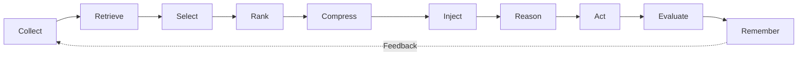

> **MAMO Context Engineering = การทำให้ AI Agent รู้ว่า “ควรรู้อะไร ควรรู้อย่างไร ควรใช้ข้อมูลไหน ควรจำอะไร และควรนำ Context ไปใช้เพื่อทำงานอย่างไร”**

---

# 35. แนวทางต่อยอดเป็นงานวิจัย

```mermaid
flowchart LR

    PROTOTYPE["MAMO Prototype"]
    RAG["RAG System"]
    MEMORY["Memory-Augmented Agent"]
    FRAMEWORK["MAMO Framework"]
    BENCHMARK["Benchmark"]
    EXPERIMENT["Experimental Framework"]
    PAPER["Research Paper"]

    PROTOTYPE --> RAG
    RAG --> MEMORY
    MEMORY --> FRAMEWORK
    FRAMEWORK --> BENCHMARK
    BENCHMARK --> EXPERIMENT
    EXPERIMENT --> PAPER
```

แนวทางการทดลองที่น่าสนใจ:

```text
LLM
    vs
LLM + RAG
    vs
LLM + RAG + Memory
    vs
LLM + RAG + Memory + Reranking
    vs
MAMO Context Engineering
```

โดยวัด:

```text
Accuracy
Context Relevance
Context Precision
Context Recall
Faithfulness
Task Success Rate
Token Usage
Latency
Cost
```

**Research Gap ที่น่าสนใจ:** การพัฒนา **Adaptive Context Engineering** ที่สามารถตัดสินใจแบบ Dynamic ว่าในแต่ละ Task ควรใช้ Memory, RAG, Knowledge Graph, Tool หรือ Context Compression ในระดับใด ก่อนส่ง Context ให้ LLM ซึ่งสามารถต่อยอด MAMO จาก Prototype ไปสู่ **Experimental Framework และ Benchmark สำหรับ AI Agent** ได้

```
```

```
